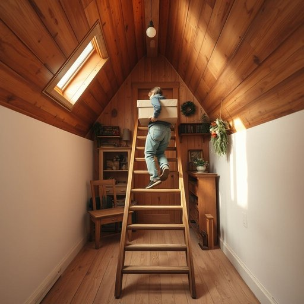

# stair

<h1 style="font-size: 2.5em; font-weight: 300; letter-spacing: 2px; margin: 0; color: #2c3e50;">
/stɛr/
</h1>

---

---

## 例句

Could you please carry those heavy boxes up the narrow, creaky stair that leads to the attic, where we store all the old furniture and seasonal decorations, before the delivery arrives later this afternoon?

*Could(/kʊd/) you(/ju/) please(/pliz/) carry(/ˈkɛri/) those(/ðoʊz/) heavy(/ˈhɛvi/) boxes(/ˈbɑksɪz/) up(/əp/) the(/ðə/) narrow,(/ˈnɛroʊ,/) creaky(/ˈkriki/) stair(/stɛr/) that(/ðət/) leads(/lidz/) to(/tɪ/) the(/ðə/) attic,(/ˈætɪk,/) where(/wɛr/) we(/wi/) store(/stɔr/) all(/ɔl/) the(/ðə/) old(/oʊld/) furniture(/ˈfərnɪʧər/) and(/ənd/) seasonal(/ˈsizənəl/) decorations,(/ˌdɛkərˈeɪʃənz,/) before(/ˌbiˈfɔr/) the(/ðə/) delivery(/dɪˈlɪvəri/) arrives(/əraɪvz/) later(/ˈleɪtər/) this(/ðɪs/) afternoon?(/ˌæftərˈnun?/)*

**翻译：** 请您帮忙把那些沉重的箱子搬上通往阁楼的狭窄吱吱作响的楼梯，阁楼里存放着我们所有的旧家具和季节性装饰品，以便下午晚些时候送货到来之前安置妥当。

---

## 解释

英语单词“stair”作为名词在家居生活用品的语境中，指的是连接房屋不同楼层的单级台阶，一般用于描述单个台阶而非整段楼梯（楼梯的复数形式为“stairs”）。具体使用场合多见于描述室内或室外的楼梯结构，如“a stair in the staircase”（楼梯中的一个台阶）或“watch your step on the last stair”（小心最后一个台阶）。学习者在使用时需注意，“stair”通常以复数形式“stairs”出现，表达完整的楼梯概念时不可误用单数，且“stairs”作名词时经常搭配动词如“climb”，“descend”，“go up/down”，同时与“step”区别在于“step”可以泛指任何脚下的台阶或踏步动作，而“stair”更具体指单个台阶。词源上，“stair”源自古英语“stæger”或“stīger”，意指登高的结构，体现了其作为上下连通工具的功能。在中文语境中，“stair”准确翻译为“台阶”，强调单个阶梯的概念，而“stairs”译为“楼梯”或“阶梯”，涵盖全部台阶的连贯集合。需要注意的是，英文中“stair”及“stairs”本身无特殊褒贬或文化色彩，属于中性描述建筑结构的名词，但在日常语言中表达安全提醒时常见，如“小心台阶”，体现了对居家安全的关注。整体上，理解和区分“stair”与“stairs”的用法对于准确表达家居楼梯细节非常关键。

---

<small style="color: #999; font-size: 0.9em;">2025-07-17 06:22:40</small>

