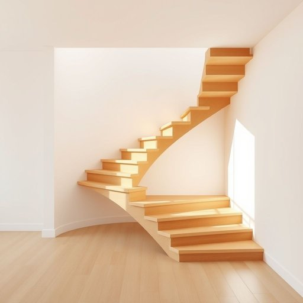

# staircase

<h1 style="font-size: 2.5em; font-weight: 300; letter-spacing: 2px; margin: 0; color: #2c3e50;">
/ˈstɛrˌkeɪs/
</h1>

---

---

## 例句

As the renovation progressed, the staircase, once a simple connection between floors, evolved into a centerpiece of architectural elegance that transformed the entire interior space.

*As(/ɛz/) the(/ðə/) renovation(/ˌrɛnəˈveɪʃən/) progressed,(/prəˈgrɛst,/) the(/ðə/) staircase,(/ˈstɛrˌkeɪs,/) once(/wəns/) a(/ə/) simple(/ˈsɪmpəl/) connection(/kəˈnɛkʃən/) between(/bɪtˈwin/) floors,(/flɔrz,/) evolved(/ɪˈvɑlvd/) into(/ˈɪntu/) a(/ə/) centerpiece(/ˈsɛntərˌpis/) of(/əv/) architectural(/ˌɑrkəˈtɛkʧərəl/) elegance(/ˈɛləgəns/) that(/ðət/) transformed(/trænsˈfɔrmd/) the(/ðə/) entire(/ɪnˈtaɪər/) interior(/ˌɪnˈtɪriər/) space.(/speɪs./)*

**翻译：** 随着装修的推进，楼梯从原本简单的楼层连接，演变成了建筑优雅的核心，彻底改变了整个室内空间的格调。

---

## 解释

英语单词staircase作为名词，主要指建筑物内部连接各层楼面的楼梯结构，通常包括台阶、扶手和支撑框架，是家庭、办公楼等多层建筑中必不可少的通行设施。在家居生活用品的语境中，staircase既可以指具体的楼梯本身，也可以泛指楼梯的整体设计和构造，通常用于描述房屋内部的楼梯布局或装饰风格。学习者在使用时需要注意，staircase通常作为可数名词使用，常见搭配有wooden staircase（木质楼梯）、spiral staircase（螺旋楼梯）、narrow staircase（狭窄的楼梯）等，此外，动词短语如climb the staircase（爬楼梯）也较常见。与其近义词stairs相比，staircase更强调楼梯的整体结构或设计，语体上较正式和书面。词源方面，staircase由stair（台阶）与case（箱、匣，后引申为包含某物的结构）组合而成，最早起源于16世纪中期，用于指包含多个台阶的结构，体现了该词汇的构造功能属性。在中文语境中，staircase准确翻译为楼梯或楼梯间，强调的是房屋内部连接各层的阶梯结构，区别于单纯的台阶或阶梯，后者可能指室外或单层的阶梯。该词语本身无褒贬色彩，也无特殊文化含义，属于中性词汇，但在室内设计、建筑学等专业领域具有较明确的技术和美学指向。

---

<small style="color: #999; font-size: 0.9em;">2025-07-17 06:22:40</small>

