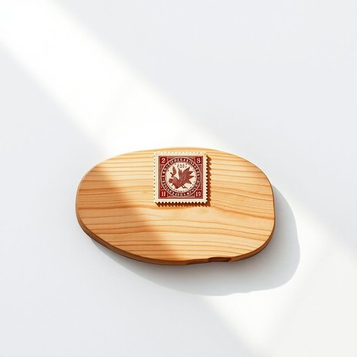

# stamp

<h1 style="font-size: 2.5em; font-weight: 300; letter-spacing: 2px; margin: 0; color: #2c3e50;">
/stæmp/
</h1>

---

---

## 例句

The collector carefully examined the ornate stamp on the ancient document, noting its intricate design and historical significance before preserving it in a climate-controlled album.

*The(/ðə/) collector(/kəˈlɛktər/) carefully(/ˈkɛrfəli/) examined(/ɪgˈzæmənd/) the(/ðə/) ornate(/ɔrˈneɪt/) stamp(/stæmp/) on(/ɔn/) the(/ðə/) ancient(/ˈeɪnʧənt/) document,(/ˈdɑkjəmɛnt,/) noting(/ˈnoʊtɪŋ/) its(/ɪts/) intricate(/ˈɪntrəkət/) design(/dɪˈzaɪn/) and(/ənd/) historical(/hɪˈstɔrɪkəl/) significance(/sɪgˈnɪfɪkəns/) before(/ˌbiˈfɔr/) preserving(/prɪˈzərvɪŋ/) it(/ɪt/) in(/ɪn/) a(/ə/) climate-controlled(/climate-controlled*/) album.(/ˈælbəm./)*

**翻译：** 收藏家仔细端详着古文献上那枚华丽的邮票，注意到其精美的纹饰和深厚的历史价值，随后将其妥善保存于恒温恒湿的收藏册中。

---

## 解释

在家居生活用品的语境中，英语单词stamp作为名词通常指邮票，即用于邮寄信件或包裹上以支付邮资的小纸片，常见于家庭中收发邮件的场合。学习者使用stamp时应注意其复数形式为stamps，且常见搭配有postage stamp（邮资邮票）和collect stamps（集邮），此外，stamp collection指的就是集邮册或邮票收藏。语法上，stamp作为名词时不可数，但特指邮票时通常视为可数名词；注意区别与动词用法（盖章、跺脚）的不同。词源方面，stamp一词来自古英语stampe，意指用力踩踏的动作，后来引申为盖印、邮票等，反映了其印记或标记的含义。中文语境中，stamp准确翻译为邮票，理解为国家邮政系统发行、贴于信件上表明已付邮资的小纸片，具有实用价值且常涉及集邮文化；该词没有特殊褒贬色彩，但邮票作为收藏品在文化层面富有趣味和历史价值，是人们日常生活和家庭交流的一部分。

---

<small style="color: #999; font-size: 0.9em;">2025-07-17 06:22:40</small>

