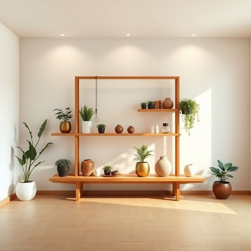

# stands

<h1 style="font-size: 2.5em; font-weight: 300; letter-spacing: 2px; margin: 0; color: #2c3e50;">
/stændz/
</h1>

---

---

## 例句

The issue with the project lies not in the technical challenges but in the lack of clear communication between the teams, which has caused delays and misunderstandings throughout the entire process.

*The(/ðə/) issue(/ˈɪʃu/) with(/wɪθ/) the(/ðə/) project(/ˈprɑʤɛkt/) lies(/laɪz/) not(/nɑt/) in(/ɪn/) the(/ðə/) technical(/ˈtɛknɪkəl/) challenges(/ˈʧælənʤɪz/) but(/bət/) in(/ɪn/) the(/ðə/) lack(/læk/) of(/əv/) clear(/klɪr/) communication(/kəmˌjunəˈkeɪʃən/) between(/bɪtˈwin/) the(/ðə/) teams,(/timz,/) which(/wɪʧ/) has(/həz/) caused(/kɔzd/) delays(/dɪˈleɪz/) and(/ənd/) misunderstandings(/ˌmɪsəndərˈstændɪŋz/) throughout(/θruaʊt/) the(/ðə/) entire(/ɪnˈtaɪər/) process.(/ˈprɔˌsɛs./)*

**翻译：** 该项目的问题不在于技术挑战，而在于各团队之间缺乏明确的沟通，这导致整个过程中出现了延误和误解。

---

## 解释

“stands”作为名词在家居生活用品的语境中，通常指用于支撑、固定或展示某种物品的架子、支架或台座，如“plant stand”（花架）、“lamp stand”（灯座）或“TV stand”（电视柜）。具体使用场合多见于描述家具布局或存放工具，例如放置盆栽的花架或用来摆放装饰物品的小型支架。英语学习者应注意，“stand”作为名词时通常是可数名词，复数形式为“stands”，且常与限定词连用，如“a stand”，“the stands”或数字表述“two stands”；此外，“stand”作为动词时意义差异较大，需根据词性区别理解和使用。此外，常见搭配或表达还有“music stand”（乐谱架）、“shoe stand”（鞋架）等，表示具体用于物品安置的装置。词源上，“stand”源自古英语“standan”，意为“站立”或“竖立”，引申为供物体站立或固定的装置。中文语境中，对应词语有“架子”、“支架”、“座”等，需结合具体物品确定最合适的译法。该词本身无褒贬含义，属中性词，文化内涵较为普通，但使用时需根据具体生活用品的不同性质和功能进行灵活翻译和理解。

---

<small style="color: #999; font-size: 0.9em;">2025-07-17 06:22:40</small>

