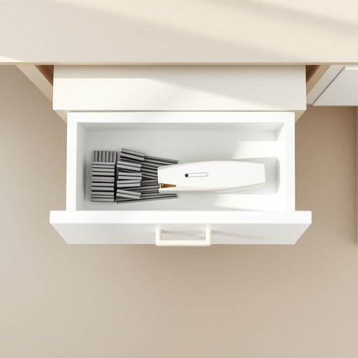

# staple

<h1 style="font-size: 2.5em; font-weight: 300; letter-spacing: 2px; margin: 0; color: #2c3e50;">
/ˈsteɪpəl/
</h1>

---

---

## 例句

Could you please check if we have enough staples in the drawer by the desk, because without that essential staple for keeping all the important bills and receipts together, it’s nearly impossible to maintain any sort of organised filing system in this cluttered home office?

*Could(/kʊd/) you(/ju/) please(/pliz/) check(/ʧɛk/) if(/ɪf/) we(/wi/) have(/hæv/) enough(/ɪˈnəf/) staples(/ˈsteɪpəlz/) in(/ɪn/) the(/ðə/) drawer(/drɔr/) by(/baɪ/) the(/ðə/) desk,(/dɛsk,/) because(/bɪˈkəz/) without(/wɪˈθaʊt/) that(/ðət/) essential(/ɛˈsɛnʃəl/) staple(/ˈsteɪpəl/) for(/fər/) keeping(/ˈkipɪŋ/) all(/ɔl/) the(/ðə/) important(/ˌɪmˈpɔrtənt/) bills(/bɪlz/) and(/ənd/) receipts(/rɪˈsits/) together,(/təˈgɛðər,/) it’s(/it’s*/) nearly(/ˈnɪrli/) impossible(/ˌɪmˈpɑsəbəl/) to(/tɪ/) maintain(/meɪnˈteɪn/) any(/ˈɛni/) sort(/sɔrt/) of(/əv/) organised(/organised*/) filing(/ˈfaɪlɪŋ/) system(/ˈsɪstəm/) in(/ɪn/) this(/ðɪs/) cluttered(/ˈklətərd/) home(/hoʊm/) office?(/ˈɔfəs?/)*

**翻译：** 请帮忙检查书桌抽屉里是否有足够的订书钉，因为没有这种将所有重要账单和收据固定在一起的必需订书钉，要在这个杂乱的家庭办公室里维持有序的文件管理几乎是不可能的。

---

## 解释

英语单词staple作为名词在家居生活用品语境中，通常指的是“订书钉”，即用于订书机把纸张固定在一起的小金属钉，是家庭、办公室中常见的文具用品。具体使用场合多见于整理文件、装订纸张、手工制作等情境，如“Please get some staples for the stapler”（请拿些订书钉来装订机）。英语学习者使用时需注意，名词staple不可数时可指“主要商品，主要产品”，但在家居文具语境中常用复数形式staples表示订书钉。搭配表达常见如“a box of staples”、“staple remover”（订书钉拔除器）等。语法上，通常作为可数名词使用，复数形式表多枚订书钉。词源来自中古英语，最初意为“主要商品、货物”，后因形态演变和使用扩展引申出订书钉之意，起初因订书钉形似小钉，且是许多文件装订的“必需品”故称为staple。在中文语境中，准确翻译为“订书钉”，避免与“主食”或“主要产品”等在经济学或食品领域的staple混淆。该词在家居用品中无褒贬色彩，属于中性词，仅表达功能性物品的概念，无特殊文化内涵。

---

<small style="color: #999; font-size: 0.9em;">2025-07-17 06:22:40</small>

