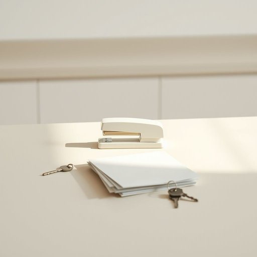

# stapler

<h1 style="font-size: 2.5em; font-weight: 300; letter-spacing: 2px; margin: 0; color: #2c3e50;">
/ˈsteɪpələr/
</h1>

---

---

## 例句

Could you please hand me the stapler that's sitting on the kitchen counter next to the pile of unopened mail and the keys, because I need to secure these documents before the postman arrives this afternoon?

*Could(/kʊd/) you(/ju/) please(/pliz/) hand(/hænd/) me(/mi/) the(/ðə/) stapler(/ˈsteɪpələr/) that's(/ðæts/) sitting(/ˈsɪtɪŋ/) on(/ɔn/) the(/ðə/) kitchen(/ˈkɪʧən/) counter(/ˈkaʊntər/) next(/nɛkst/) to(/tɪ/) the(/ðə/) pile(/paɪl/) of(/əv/) unopened(/əˈnoʊpənd/) mail(/meɪl/) and(/ənd/) the(/ðə/) keys,(/kiz,/) because(/bɪˈkəz/) I(/aɪ/) need(/nid/) to(/tɪ/) secure(/sɪˈkjʊr/) these(/ðiz/) documents(/ˈdɑkjəmənts/) before(/ˌbiˈfɔr/) the(/ðə/) postman(/ˈpoʊstmən/) arrives(/əraɪvz/) this(/ðɪs/) afternoon?(/ˌæftərˈnun?/)*

**翻译：** 请把放在厨房台面上、那些未拆邮件堆旁边的订书机递给我，好让我在邮递员今天下午到来之前将这些文件订好。

---

## 解释

英语单词“stapler”在家居生活用品的场景中作为名词，指的是一种用于将纸张钉合在一起的订书机，通常见于家庭、办公室或学校环境中，使用时将订书针插入纸张后通过机械压力将纸张固定。英语学习者在使用“stapler”时应注意它是可数名词，常见搭配有“一把订书机”（a stapler）、“使用订书机”（to use a stapler）、“重型订书机”（a heavy-duty stapler）等，另外，与“staple”（订书针）这个相关词汇常同时出现。语法上，“stapler”作为物品名词，通常用作主语或宾语，不带复数时指单一物品，复数形式为“staplers”。词源上，“stapler”源自英语单词“staple”（订书针或主要物品）加上表示工具的后缀“-er”，字面意思即“用来订书针的工具”。在中文语境中，“stapler”准确翻译为“订书机”，是书写和文件整理中常用的文具用品，无特殊褒贬或文化色彩，属于中性物品名称。整体上，“stapler”作为日常办公或家用小工具，表达清晰、用途明确，是学习英语时常见且实用的词汇。

---

<small style="color: #999; font-size: 0.9em;">2025-07-17 06:22:40</small>

