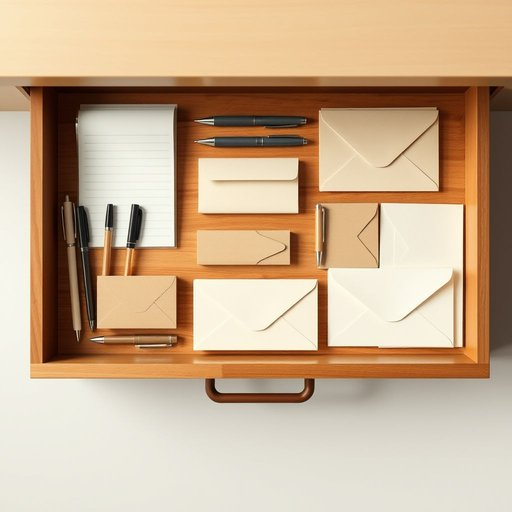

# stationery

<h1 style="font-size: 2.5em; font-weight: 300; letter-spacing: 2px; margin: 0; color: #2c3e50;">
/ˈsteɪʃəˌnɛri/
</h1>

---

---

## 例句

Could you please tidy up the drawer in the study, where all the stationery—such as pens, notepads, and envelopes—that we use for writing letters and organizing bills is scattered around, because it’s becoming increasingly difficult to find anything when I need to write a quick note or send a parcel?

*Could(/kʊd/) you(/ju/) please(/pliz/) tidy(/ˈtaɪdi/) up(/əp/) the(/ðə/) drawer(/drɔr/) in(/ɪn/) the(/ðə/) study,(/ˈstədi,/) where(/wɛr/) all(/ɔl/) the(/ðə/) stationery—such(/stationery—such*/) as(/ɛz/) pens,(/pɛnz,/) notepads,(/notepads*,/) and(/ənd/) envelopes—that(/envelopes—that*/) we(/wi/) use(/juz/) for(/fər/) writing(/ˈraɪtɪŋ/) letters(/ˈlɛtərz/) and(/ənd/) organizing(/ˈɔrgəˌnaɪzɪŋ/) bills(/bɪlz/) is(/ɪz/) scattered(/ˈskætərd/) around,(/əraʊnd,/) because(/bɪˈkəz/) it’s(/it’s*/) becoming(/bɪˈkəmɪŋ/) increasingly(/ˌɪnˈkrisɪŋgli/) difficult(/ˈdɪfəkəlt/) to(/tɪ/) find(/faɪnd/) anything(/ˈɛniˌθɪŋ/) when(/wɪn/) I(/aɪ/) need(/nid/) to(/tɪ/) write(/raɪt/) a(/ə/) quick(/kwɪk/) note(/noʊt/) or(/ər/) send(/sɛnd/) a(/ə/) parcel?(/ˈpɑrsəl?/)*

**翻译：** 请帮忙整理一下书房的抽屉，那里放着我们用来写信和整理账单的各种文具，比如钢笔、笔记本和信封，现在都乱七八糟，导致我需要快速写便条或寄包裹时越来越难找到东西。

---

## 解释

单词“stationery”作为名词在家居生活用品的语境中，通常指各类书写和办公用具，如信纸、信封、笔、纸张、便签等，常用于描述日常书写、办公或学习所需的物品，具体使用场合多见于家庭书房、办公室或学校环境中，讨论文具采购、整理或使用时，比如“买一些stationery”表示购买纸张和笔等文具用品，英语学习者需要注意的是，“stationery”只作名词使用，且拼写容易与发音相近但含义不同的形容词“stationary”（意为“静止的，不动的”）混淆，因此区分拼写和意义非常关键，此外，它通常为不可数名词，也可用作集合名词表泛指文具类产品，常见搭配有“stationery items”、“stationery set”等，词源上，“stationery”源自中古英语“stationer”，指在固定地点（station）售卖书籍或文具的商人，后来引申为商人所售卖的商品本身，即文具用品，这一历史背景反映了该词与固定地点和书写材料的关联，在中文语境中，“stationery”准确翻译为“文具”或“办公用品”，强调的是书写相关的物品，而非家用小物或其他杂货，理解时应避免与“stationary”（静止的）混淆，也无特别褒贬色彩，属于中性词汇，常见于对家庭和办公环境中文具类物品的描述中。

---

<small style="color: #999; font-size: 0.9em;">2025-07-17 06:22:40</small>

