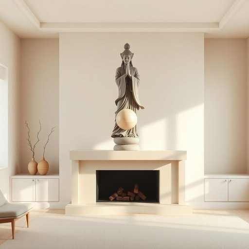

# statue

<h1 style="font-size: 2.5em; font-weight: 300; letter-spacing: 2px; margin: 0; color: #2c3e50;">
/ˈstæˌʧu/
</h1>

---

---

## 例句

Although the statue you placed on the mantelpiece might seem like a simple decorative item, its intricate design, which depicts an ancient mythical figure clutching a delicate orb, actually adds a surprising sense of historical depth and artistic flair to the otherwise modern and minimalist living room.

*Although(/ˌɔlˈðoʊ/) the(/ðə/) statue(/ˈstæˌʧu/) you(/ju/) placed(/pleɪst/) on(/ɔn/) the(/ðə/) mantelpiece(/mantelpiece*/) might(/maɪt/) seem(/sim/) like(/laɪk/) a(/ə/) simple(/ˈsɪmpəl/) decorative(/ˈdɛkrətɪv/) item,(/ˈaɪtəm,/) its(/ɪts/) intricate(/ˈɪntrəkət/) design,(/dɪˈzaɪn,/) which(/wɪʧ/) depicts(/dɪˈpɪkts/) an(/ən/) ancient(/ˈeɪnʧənt/) mythical(/ˈmɪθɪkəl/) figure(/ˈfɪgjər/) clutching(/ˈkləʧɪŋ/) a(/ə/) delicate(/ˈdɛləkət/) orb,(/ɔrb,/) actually(/ˈæˌkʧuəli/) adds(/ædz/) a(/ə/) surprising(/səˈpraɪzɪŋ/) sense(/sɛns/) of(/əv/) historical(/hɪˈstɔrɪkəl/) depth(/dɛpθ/) and(/ənd/) artistic(/ɑrˈtɪstɪk/) flair(/flɛr/) to(/tɪ/) the(/ðə/) otherwise(/ˈəðərˌwaɪz/) modern(/ˈmɑdərn/) and(/ənd/) minimalist(/ˈmɪnəməlɪst/) living(/ˈlɪvɪŋ/) room.(/rum./)*

**翻译：** 虽然你放在壁炉架上的那个雕像看似一件简单的装饰品，但其描绘一位古代神话人物手握精致玉球的复杂设计，实际上为这间本 otherwise 现代且极简的客厅增添了意想不到的历史厚重感与艺术韵味。

---

## 解释

英语单词"statue"作为名词，在家居生活用品的语境中，通常指的是用来装饰室内或庭院的雕像或塑像，这些雕像可以是人物、动物或抽象形状，常作为装饰艺术品出现，增添空间美感和文化氛围。使用时，"statue"一般用作可数名词，需注意单复数形式如"a statue"与"statues"的区分，常见搭配包括"garden statue"（花园雕像）、"decorative statue"（装饰雕像）、"marble statue"（大理石雕像）等。此外，"statue of"结构常用于表示某人或某物的雕像，如"statue of liberty"（自由女神像）。词源方面，"statue"源自拉丁语"statua"，意为“站立的形象”，体现了雕像通常为立体且固定的形态。在中文语境中，"statue"准确翻译为“雕像”或“塑像”，强调其作为艺术品的物理形态和观赏价值，而非简单的模型或手工艺品。从文化角度看，雕像常带有纪念意义或象征含义，既可表现历史人物，也可体现审美趣味，通常无褒贬色彩，但在不同文化背景中雕像的风格和意义可能有所差异，英语学习者需理解其正式、书面且具体指实物的特点，避免与同义词如“figure”（更小型或抽象形象）混淆。

---

<small style="color: #999; font-size: 0.9em;">2025-07-17 06:22:40</small>

