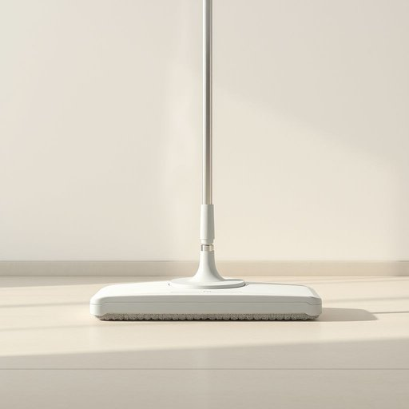

# steam-mop

<h1 style="font-size: 2.5em; font-weight: 300; letter-spacing: 2px; margin: 0; color: #2c3e50;">
/steam-mop*/
</h1>

---

---

## 例句

After noticing the stubborn stains on the kitchen floor, she decided to use the steam-mop, which, thanks to its powerful jets of steam and rotating head, not only sanitized the surface thoroughly but also saved her hours of scrubbing, making it an indispensable gadget in her weekly cleaning routine.

*After(/ˈæftər/) noticing(/ˈnoʊtɪsɪŋ/) the(/ðə/) stubborn(/ˈstəbərn/) stains(/steɪnz/) on(/ɔn/) the(/ðə/) kitchen(/ˈkɪʧən/) floor,(/flɔr,/) she(/ʃi/) decided(/ˌdɪˈsaɪdɪd/) to(/tɪ/) use(/juz/) the(/ðə/) steam-mop,(/steam-mop*,/) which,(/wɪʧ,/) thanks(/θæŋks/) to(/tɪ/) its(/ɪts/) powerful(/ˈpaʊərfəl/) jets(/ʤɛts/) of(/əv/) steam(/stim/) and(/ənd/) rotating(/ˈroʊˌteɪtɪŋ/) head,(/hɛd,/) not(/nɑt/) only(/ˈoʊnli/) sanitized(/ˈsænɪˌtaɪzd/) the(/ðə/) surface(/ˈsərfəs/) thoroughly(/ˈθəroʊli/) but(/bət/) also(/ˈɔlsoʊ/) saved(/seɪvd/) her(/hər/) hours(/aʊərz/) of(/əv/) scrubbing,(/ˈskrəbɪŋ,/) making(/ˈmeɪkɪŋ/) it(/ɪt/) an(/ən/) indispensable(/ˌɪndɪˈspɛnsəbəl/) gadget(/ˈgæʤət/) in(/ɪn/) her(/hər/) weekly(/ˈwikli/) cleaning(/ˈklinɪŋ/) routine.(/ruˈtin./)*

**翻译：** 注意到厨房地板上的顽固污渍后，她决定使用蒸汽拖把。得益于其强劲的蒸汽喷射和旋转拖头，不仅彻底消毒了地面，还为她节省了数小时的刷洗时间，使其成为她每周清洁中不可或缺的利器。

---

## 解释

英语单词“steam-mop”作为名词，指的是一种利用蒸汽清洁地面的家用电器，常见于家庭或办公室的硬质地板（如瓷砖、木地板）清洁场合。它通过高温蒸汽软化污渍，减少化学清洁剂的使用，体现环保和高效的清洁方式。英语学习者在使用该词时需注意其复合词结构，一般作为单数名词使用，复数形式是“steam-mops”；常见搭配包括“use a steam-mop”（使用蒸汽拖把）、“clean the floor with a steam-mop”（用蒸汽拖把清洁地板）等，表达时多用于具体描述清洁行为或工具特性。词源方面，“steam”意为蒸汽，“mop”指拖把，二者合成新词描述依赖蒸汽的拖把，这一技术在20世纪末新型清洁设备兴起后逐渐普及。在中文语境中，“steam-mop”准确翻译为“蒸汽拖把”，这一译法突出其蒸汽功能，且符合家居用品命名习惯，无特殊褒贬或文化隐含意义，仅为实用工具名称，使用时需根据具体上下文确定适用类型和效果。

---

<small style="color: #999; font-size: 0.9em;">2025-07-17 06:22:40</small>

