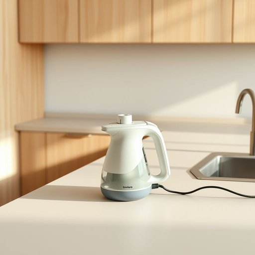

# steamer

<h1 style="font-size: 2.5em; font-weight: 300; letter-spacing: 2px; margin: 0; color: #2c3e50;">
/ˈstimər/
</h1>

---

---

## 例句

Before we start cooking dinner, could you please fetch the steamer from the cupboard next to the sink, the one with the slightly chipped lid and the silicone handles, so I can quickly steam the vegetables while preparing the sauce?

*Before(/ˌbiˈfɔr/) we(/wi/) start(/stɑrt/) cooking(/ˈkʊkɪŋ/) dinner,(/ˈdɪnər,/) could(/kʊd/) you(/ju/) please(/pliz/) fetch(/fɛʧ/) the(/ðə/) steamer(/ˈstimər/) from(/frəm/) the(/ðə/) cupboard(/ˈkəbərd/) next(/nɛkst/) to(/tɪ/) the(/ðə/) sink,(/sɪŋk,/) the(/ðə/) one(/wən/) with(/wɪθ/) the(/ðə/) slightly(/sˈlaɪtli/) chipped(/ʧɪpt/) lid(/lɪd/) and(/ənd/) the(/ðə/) silicone(/ˈsɪləˌkoʊn/) handles,(/ˈhændəlz,/) so(/soʊ/) I(/aɪ/) can(/kən/) quickly(/kˈwɪkli/) steam(/stim/) the(/ðə/) vegetables(/ˈvɛʤtəbəlz/) while(/waɪl/) preparing(/pərˈpɛrɪŋ/) the(/ðə/) sauce?(/sɔs?/)*

**翻译：** 在我们开始做晚饭之前，能否请你帮忙从水槽旁的橱柜里拿出那个带有轻微缺口盖子和硅胶手柄的蒸锅，好让我在准备酱汁时能快速蒸蔬菜？

---

## 解释

英语单词“steamer”在家居生活用品场景中通常指的是一种蒸汽设备，常见的有蒸汽熨斗（clothing steamer）或蒸汽清洁器，用于利用蒸汽去皱、清洁衣物或家居表面，具体使用场合多为家庭日常生活中衣物护理或清洁过程中。在语法上，“steamer”作为可数名词使用，常见搭配有“a steamer”，“the steamer”，或与功能相关的形容词如“handheld steamer”（手持蒸汽机），“garment steamer”（衣物蒸汽机）等；英语学习者应注意其单数复数形式“steamers”，且常用作具体名词指代设备而非抽象概念。词源方面，“steamer”来源于动词“steam”，意为“蒸汽”，加上表示“执行者或工具”的后缀“-er”，最初指使用蒸汽动力的机器，工业革命期间得名，随着家用电器的发展，衍生为指家用蒸汽熨斗或清洁设备。在中文语境中，“steamer”一般准确翻译为“蒸汽熨斗”或“蒸汽机”，具体根据上下文指衣物蒸汽机时常译为“蒸汽熨斗”，指清洁用时可能译为“蒸汽清洁机”，无褒贬含义，属于中性词汇，使用时需结合具体产品属性和用途明确指代，避免误解为传统的蒸锅或蒸笼等蒸制厨房用具。

---

<small style="color: #999; font-size: 0.9em;">2025-07-17 06:22:40</small>

