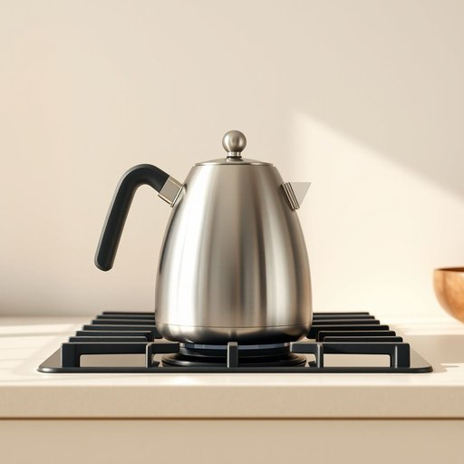

# steel

<h1 style="font-size: 2.5em; font-weight: 300; letter-spacing: 2px; margin: 0; color: #2c3e50;">
/stil/
</h1>

---

---

## 例句

The kettle on the stove emitted a sharp whistle, signaling that the water inside had reached boiling point after several minutes of intense heat.

*The(/ðə/) kettle(/ˈkɛtəl/) on(/ɔn/) the(/ðə/) stove(/stoʊv/) emitted(/ɪˈmɪtɪd/) a(/ə/) sharp(/ʃɑrp/) whistle,(/ˈwɪsəl,/) signaling(/ˈsɪgnəlɪŋ/) that(/ðət/) the(/ðə/) water(/ˈwɔtər/) inside(/ˌɪnˈsaɪd/) had(/hæd/) reached(/riʧt/) boiling(/ˈbɔɪlɪŋ/) point(/pɔɪnt/) after(/ˈæftər/) several(/ˈsɛvərəl/) minutes(/ˈmɪnəts/) of(/əv/) intense(/ˌɪnˈtɛns/) heat.(/hit./)*

**翻译：** 炉子上的水壶发出尖锐的哨声，宣告经过数分钟的剧烈加热，水已沸腾。

---

## 解释

英语单词“steel”作为名词在家居生活用品的语境中，通常指由铁和碳等元素合金制成的坚硬金属材料，广泛用于制造各种厨房用具、家具框架、工具以及装修配件等。例如，不锈钢水槽（stainless steel sink）、钢制厨刀（steel knife）或钢制椅子（steel chair）都是常见的使用场合。在语法上，“steel”作为不可数名词时通常不加复数形式，表示材料本身，如“the handle is made of steel”；作为可数名词时指具体的一根钢制物品时，才加复数形式“steels”，但这种用法较少。常见搭配有“stainless steel”（不锈钢）、“steel frame”（钢架）、“steel wire”（钢丝）等，学习者应注意区分其与“iron”（铁）的区别，且“steel”一词与金属的坚固、耐用性质密切相关，常用于表达物品的质量和耐久度。词源方面，“steel”源自古英语“stēle”，与古日耳曼语族词汇相关，历史上指坚硬、可锻造的金属材料，其含义长期未变。中文中“steel”准确翻译为“钢”，是一种金属材料名词，强调其材质特性，在日常用语中没有褒贬色彩，但因其坚硬和耐用的象征意义，有时在比喻中也指意志坚强或刚毅。在家居用品语境中理解为“钢”可准确传达其材质属性和使用价值。

---

<small style="color: #999; font-size: 0.9em;">2025-07-17 06:22:40</small>

