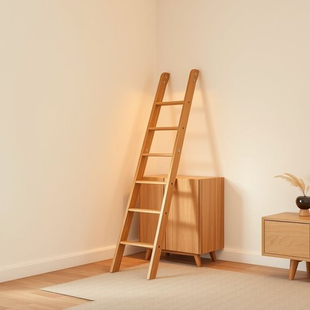

# stepladder

<h1 style="font-size: 2.5em; font-weight: 300; letter-spacing: 2px; margin: 0; color: #2c3e50;">
/ˈstɛˌplædər/
</h1>

---

---

## 例句

Before you start decorating the top shelves of the living room cabinet, it might be a good idea to fetch the stepladder from the garage, which—despite its slightly wobbly legs—has always been sturdy enough to help me reach those awkward spots without risking a fall.

*Before(/ˌbiˈfɔr/) you(/ju/) start(/stɑrt/) decorating(/ˈdɛkərˌeɪtɪŋ/) the(/ðə/) top(/tɔp/) shelves(/ʃɛlvz/) of(/əv/) the(/ðə/) living(/ˈlɪvɪŋ/) room(/rum/) cabinet,(/ˈkæbənət,/) it(/ɪt/) might(/maɪt/) be(/bi/) a(/ə/) good(/gʊd/) idea(/aɪˈdiə/) to(/tɪ/) fetch(/fɛʧ/) the(/ðə/) stepladder(/ˈstɛˌplædər/) from(/frəm/) the(/ðə/) garage,(/gərɑʒ,/) which—despite(/which—despite*/) its(/ɪts/) slightly(/sˈlaɪtli/) wobbly(/ˈwɑbəli/) legs—has(/legs—has*/) always(/ˈɔlˌweɪz/) been(/bɪn/) sturdy(/ˈstərdi/) enough(/ɪˈnəf/) to(/tɪ/) help(/hɛlp/) me(/mi/) reach(/riʧ/) those(/ðoʊz/) awkward(/ˈɔkwərd/) spots(/spɑts/) without(/wɪˈθaʊt/) risking(/ˈrɪskɪŋ/) a(/ə/) fall.(/fɔl./)*

**翻译：** 在开始装饰客厅柜子的顶层搁板之前，不妨先去车库拿一下折梯，虽然它的腿有些摇晃，但一直足够稳固，帮我安全够到那些别扭的位置，而不用担心摔跤。

---

## 解释

单词“stepladder”作为名词，在家居生活用品领域指一种可折叠的便携式多级小梯子，通常带有脚踏板，便于家庭成员在室内或室外进行高处作业，如换灯泡、拿取高处物品、清洁窗户等。使用场合多涉及家用、装修、园艺或仓储等情境，强调安全稳固和便捷携带。英语学习者在使用“stepladder”时需注意它是可数名词，一般用复数形式“stepladders”表示多个，且常与“use,” “climb,” “fold,” “carry,” “set up”等动词搭配，如“use a stepladder to reach the shelf”。此外，形容词如“portable stepladder”或“folding stepladder”常用来描述其特性。词源上，“stepladder”由“step”（踏步、台阶）和“ladder”（梯子）复合而成，直观表明它具有踏步设计的梯子，最早起源于英语国家用于区分传统直梯和带踏步的梯子，体现结构上的差异。在中文语境中，“stepladder”准确翻译为“折叠梯”或“小折梯”，强调其便于折叠携带和多级踏步的特征。该词无特殊褒贬色彩，属于中性词汇，主要作为实用工具的名称出现，无特定文化内涵，适合日常生活和家居维护的语境使用。

---

<small style="color: #999; font-size: 0.9em;">2025-07-17 06:22:40</small>

