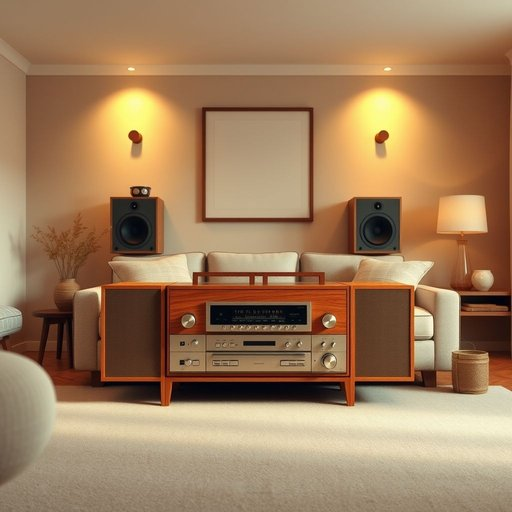

# stereo

<h1 style="font-size: 2.5em; font-weight: 300; letter-spacing: 2px; margin: 0; color: #2c3e50;">
/ˈstɛriˌoʊ/
</h1>

---

---

## 例句

While I was tidying up the living room, I noticed that the stereo, which my grandparents had bought back in the seventies and my dad had carefully restored over the years, still produced such a warm, rich sound that it filled the entire house, making every evening feel like a cozy gathering despite the hustle and bustle outside.

*While(/waɪl/) I(/aɪ/) was(/wɑz/) tidying(/tidying*/) up(/əp/) the(/ðə/) living(/ˈlɪvɪŋ/) room,(/rum,/) I(/aɪ/) noticed(/ˈnoʊtɪst/) that(/ðət/) the(/ðə/) stereo,(/ˈstɛriˌoʊ,/) which(/wɪʧ/) my(/maɪ/) grandparents(/ˈgrændˌpɛrənts/) had(/hæd/) bought(/bɔt/) back(/bæk/) in(/ɪn/) the(/ðə/) seventies(/ˈsɛvəntiz/) and(/ənd/) my(/maɪ/) dad(/dæd/) had(/hæd/) carefully(/ˈkɛrfəli/) restored(/rɪˈstɔrd/) over(/ˈoʊvər/) the(/ðə/) years,(/jɪrz,/) still(/stɪl/) produced(/prəˈdust/) such(/səʧ/) a(/ə/) warm,(/wɔrm,/) rich(/rɪʧ/) sound(/saʊnd/) that(/ðət/) it(/ɪt/) filled(/fɪld/) the(/ðə/) entire(/ɪnˈtaɪər/) house,(/haʊs,/) making(/ˈmeɪkɪŋ/) every(/ˈɛvəri/) evening(/ˈivnɪŋ/) feel(/fil/) like(/laɪk/) a(/ə/) cozy(/ˈkoʊzi/) gathering(/ˈgæðərɪŋ/) despite(/dɪˈspaɪt/) the(/ðə/) hustle(/ˈhəsəl/) and(/ənd/) bustle(/ˈbəsəl/) outside.(/ˈaʊtˈsaɪd./)*

**翻译：** 当我整理客厅时，注意到祖父母七十年代购置、父亲多年精心修复的那台立体声音响，依然发出温暖而醇厚的声音，充盈整个房间，使每个夜晚都如同温馨的聚会，尽管外面喧嚣不止。

---

## 解释

英语单词“stereo”作为名词在家居生活用品的语境中，通常指的是“立体声音响设备”，即可以播放立体声音乐或音频的电子装置，常见于家庭客厅、卧室或娱乐室中，使用场合多为听音乐、看电影或娱乐放松时。英语学习者在使用“stereo”时应注意其作名词时通常单数使用，但可指代整体设备，不可直接用复数形式“stereos”表示多台设备，且常与定冠词“the”连用，如“turn on the stereo”（打开音响）；常见搭配包括“stereo system”（立体声音响系统）、“stereo speakers”（立体声扬声器）等，表达时注意其为可数名词且通常具体指一套设备。词源方面，“stereo”源自希腊语“stereos”，意为“坚固的、立体的”，最初用以描述声音的空间感，后来引申为能够产生立体声效果的设备。中文语境中，“stereo”准确翻译为“立体声设备”或简称“音响”，强调其能提供左右声道分离音效的功能，避免混淆为单声道或普通音响设备。该词在日常生活中无褒贬色彩，是中性词汇，代表一种常见的家用娱乐电子产品，具备一定技术性和现代感，因此在使用时体现出电器设备的专业或家庭娱乐层面的含义。

---

<small style="color: #999; font-size: 0.9em;">2025-07-17 06:22:40</small>

