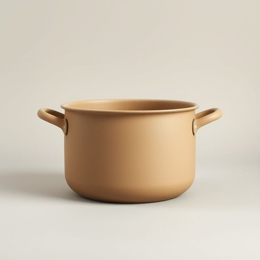

# stockpot

<h1 style="font-size: 2.5em; font-weight: 300; letter-spacing: 2px; margin: 0; color: #2c3e50;">
/stockpot*/
</h1>

---

---

## 例句

Could you please pass me the large stockpot from the top shelf, the one with the worn handles and slightly chipped enamel, because I want to simmer the beef broth for several hours before adding the vegetables and herbs that we picked up fresh from the market this morning?

*Could(/kʊd/) you(/ju/) please(/pliz/) pass(/pæs/) me(/mi/) the(/ðə/) large(/lɑrʤ/) stockpot(/stockpot*/) from(/frəm/) the(/ðə/) top(/tɔp/) shelf,(/ʃɛlf,/) the(/ðə/) one(/wən/) with(/wɪθ/) the(/ðə/) worn(/wɔrn/) handles(/ˈhændəlz/) and(/ənd/) slightly(/sˈlaɪtli/) chipped(/ʧɪpt/) enamel,(/ɪˈnæməl,/) because(/bɪˈkəz/) I(/aɪ/) want(/wɔnt/) to(/tɪ/) simmer(/ˈsɪmər/) the(/ðə/) beef(/bif/) broth(/brɔθ/) for(/fər/) several(/ˈsɛvərəl/) hours(/aʊərz/) before(/ˌbiˈfɔr/) adding(/ˈædɪŋ/) the(/ðə/) vegetables(/ˈvɛʤtəbəlz/) and(/ənd/) herbs(/ərbz/) that(/ðət/) we(/wi/) picked(/pɪkt/) up(/əp/) fresh(/frɛʃ/) from(/frəm/) the(/ðə/) market(/ˈmɑrkɪt/) this(/ðɪs/) morning?(/ˈmɔrnɪŋ?/)*

**翻译：** 你能帮我从顶层货架上拿那个大汤锅吗？就是那个手柄有些磨损、搪瓷略微剥落的，因为我想先小火炖几个小时牛骨汤，然后再加入我们今天早上从市场上现买的新鲜蔬菜和香草。

---

## 解释

stockpot作为名词在家居生活用品领域中指的是一种容量较大、通常带盖的厚底炖锅，专门用于煮制高汤（stock）、汤汁和炖菜等。具体使用场合多见于厨房，尤其是在需要长时间慢炖或大量烹煮汤汁时，如制作浓汤、煲汤、熬制肉汤等。英语学习者在使用stockpot时应注意其为可数名词，通常用单数形式指一只锅，多数情况下与介词in或on搭配使用，如cook in a stockpot或put the ingredients into the stockpot；此外，其复数形式为stockpots。常见的搭配有large stockpot（大炖锅）、stainless steel stockpot（不锈钢炖锅）等，表达时可结合容量单位，如a 6-quart stockpot，以加强具体描述。该词来自stock（汤料、高汤）和pot（锅）的合成构词，意指用于煮制汤料的锅具。中文语境中，stockpot准确翻译为炖锅或汤锅，强调其用于熬汤和慢炖的功能，与日常普通的锅具不同，突出其容量大和厚重耐用的特性。该词本身无褒贬色彩，属于中性厨房用具词汇，文化内涵主要关联西方烹饪习惯中对浓汤和高汤制作的重视，因此在理解时应结合中西餐烹饪场景的差异。

---

<small style="color: #999; font-size: 0.9em;">2025-07-17 06:22:40</small>

