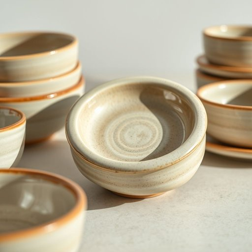

# stoneware

<h1 style="font-size: 2.5em; font-weight: 300; letter-spacing: 2px; margin: 0; color: #2c3e50;">
/ˈstoʊnˌwɛr/
</h1>

---

---

## 例句

The complexity of the stoneware lies not only in its ability to retain heat better than ordinary ceramics but also in how its durable, glazed surface provides exceptional resistance to chipping and staining, making it indispensable for both casual meals and elegant dinnerware settings.

*The(/ðə/) complexity(/kəmˈplɛksɪti/) of(/əv/) the(/ðə/) stoneware(/ˈstoʊnˌwɛr/) lies(/laɪz/) not(/nɑt/) only(/ˈoʊnli/) in(/ɪn/) its(/ɪts/) ability(/əˈbɪləˌti/) to(/tɪ/) retain(/rɪˈteɪn/) heat(/hit/) better(/ˈbɛtər/) than(/ðən/) ordinary(/ˈɔrdəˌnɛri/) ceramics(/sərˈæmɪks/) but(/bət/) also(/ˈɔlsoʊ/) in(/ɪn/) how(/haʊ/) its(/ɪts/) durable,(/ˈdʊrəbəl,/) glazed(/gleɪzd/) surface(/ˈsərfəs/) provides(/prəˈvaɪdz/) exceptional(/ɪkˈsɛpʃənəl/) resistance(/rɪˈzɪstəns/) to(/tɪ/) chipping(/ˈʧɪpɪŋ/) and(/ənd/) staining,(/ˈsteɪnɪŋ,/) making(/ˈmeɪkɪŋ/) it(/ɪt/) indispensable(/ˌɪndɪˈspɛnsəbəl/) for(/fər/) both(/boʊθ/) casual(/ˈkæʒəwəl/) meals(/milz/) and(/ənd/) elegant(/ˈɛləgənt/) dinnerware(/ˈdɪnərˌwɛr/) settings.(/ˈsɛtɪŋz./)*

**翻译：** 石器的复杂之处不仅在于其比普通陶瓷更优越的保温能力，更在于其坚固的釉面能够出色地抵抗磕碰和污渍，使其既适合日常餐饮，又适用于高雅的餐具场合，成为不可或缺的选择。

---

## 解释

英语单词stoneware作为名词，主要指一种用黏土制成，经高温烧制后呈坚硬、致密、非多孔状态的陶器，常用于制作家居生活用品如碗、盘、杯等陶瓷器具。这类器皿因其耐用、防漏水及较强的抗化学性，在厨房和餐桌上广泛应用，如盛装食物、饮品或用于烹饪。学习者在使用stoneware时应注意它是不可数名词，通常不用于复数形式，且多与表示器皿类型的词如dishes、plates、cookware等搭配使用；此外，stoneware不能与earthenware（陶土器）或porcelain（瓷器）混淆，因材料和烧制温度不同，性能和质感也有较大差异。该词来源于英文stone（石头）与ware（器皿）的结合，反映出其产品坚硬且像石头般耐用的特性，起源于18世纪的陶瓷工业发展。中文语境中，stoneware通常被准确译为石器或石质瓷器，具体指石器陶瓷，强调其质地坚硬、耐用及烧制后的非多孔性质，不含任何贬义或褒义色彩，属于中性词汇。在实际生活中，这类陶器因质朴耐用被广泛认可，是许多家庭餐具的常见材质，且常作为传统工艺和现代实用相结合的代表，具有一定的文化内涵和工艺价值。

---

<small style="color: #999; font-size: 0.9em;">2025-07-17 06:22:40</small>

