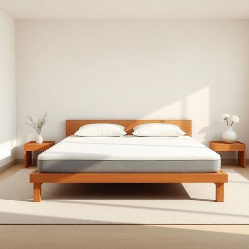

# stopper

<h1 style="font-size: 2.5em; font-weight: 300; letter-spacing: 2px; margin: 0; color: #2c3e50;">
/ˈstɑpər/
</h1>

---

---

## 例句

Could you please check if the mattress topper I ordered online, which is made of memory foam and promises to improve lumbar support as well as temperature regulation, has arrived, because without that additional topper, the bed feels far too firm and uncomfortable for a good night’s sleep?

*Could(/kʊd/) you(/ju/) please(/pliz/) check(/ʧɛk/) if(/ɪf/) the(/ðə/) mattress(/ˈmætrəs/) topper(/ˈtɑpər/) I(/aɪ/) ordered(/ˈɔrdərd/) online,(/ˈɔnˌlaɪn,/) which(/wɪʧ/) is(/ɪz/) made(/meɪd/) of(/əv/) memory(/ˈmɛməri/) foam(/foʊm/) and(/ənd/) promises(/ˈprɑməsəz/) to(/tɪ/) improve(/ˌɪmˈpruv/) lumbar(/ˈləmˌbɑr/) support(/səˈpɔrt/) as(/ɛz/) well(/wɛl/) as(/ɛz/) temperature(/ˈtɛmpərəʧər/) regulation,(/ˌrɛgjəˈleɪʃən,/) has(/həz/) arrived,(/əraɪvd,/) because(/bɪˈkəz/) without(/wɪˈθaʊt/) that(/ðət/) additional(/əˈdɪʃənəl/) topper,(/ˈtɑpər,/) the(/ðə/) bed(/bɛd/) feels(/filz/) far(/fɑr/) too(/tu/) firm(/fərm/) and(/ənd/) uncomfortable(/ənˈkəmfərtəbəl/) for(/fər/) a(/ə/) good(/gʊd/) night’s(/night’s*/) sleep?(/slip?/)*

**翻译：** 请您帮忙确认一下，我在线订购的那款记忆泡沫床垫保护垫是否已经送达？它承诺能够改善腰部支撑并调节温度。因为没有这层额外的保护垫，床铺感觉过于坚硬，无法获得良好的睡眠体验。

---

## 解释

英语单词stopper作为名词在家居生活用品场景中通常指用来封堵容器口或管道开口的物品，如瓶塞、瓶盖、塞子等，主要功能是防止液体气体泄漏或异物进入，这类词汇常出现在厨房、储物、浴室等环境中，比如酒瓶的瓶塞wine stopper、洗手池排水塞bathroom sink stopper等，英语学习者使用stopper时应注意其作名词时的单复数形式单数为stopper复数为stoppers，并且常与表示对象的名词搭配使用，如bottle stopper瓶塞、drain stopper排水口塞等，此外，stopper在口语和书面语中均较为常见，表达直接具体，通常不含贬义，词源上，stopper源自于动词stop的派生形式，表示阻止停止之意，添加后缀er形成名词，意指用来阻止的东西，这一构词方式反映了其基本功能，从中文语境看，stopper可准确翻译为塞子瓶塞或堵塞物，强调其作为物理阻隔物的作用，没有特殊文化色彩或情感褒义，适用于生活用品领域相关描述，是一个功能性强且用法明确的名词。

---

<small style="color: #999; font-size: 0.9em;">2025-07-17 06:22:40</small>

