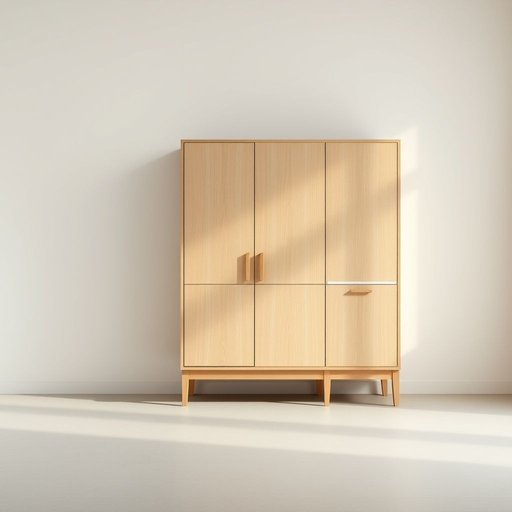

# storage

<h1 style="font-size: 2.5em; font-weight: 300; letter-spacing: 2px; margin: 0; color: #2c3e50;">
/ˈstɔrɪʤ/
</h1>

---

---

## 例句

Given the limited cupboard space in the kitchen, the cupboard's design requires careful consideration to optimise storage capacity while maintaining accessibility.

*Given(/ˈgɪvɪn/) the(/ðə/) limited(/ˈlɪmɪtɪd/) cupboard(/ˈkəbərd/) space(/speɪs/) in(/ɪn/) the(/ðə/) kitchen,(/ˈkɪʧən,/) the(/ðə/) cupboard's(/cupboard's*/) design(/dɪˈzaɪn/) requires(/rikˈwaɪərz/) careful(/ˈkɛrfəl/) consideration(/kənˌsɪdərˈeɪʃən/) to(/tɪ/) optimise(/optimise*/) storage(/ˈstɔrɪʤ/) capacity(/kəˈpæsɪti/) while(/waɪl/) maintaining(/meɪnˈteɪnɪŋ/) accessibility.(/ˌæksɛsəˈbɪlɪti./)*

**翻译：** 考虑到厨房橱柜空间有限，橱柜的设计需谨慎规划，以在优化储物容量的同时保障使用的便捷性。

---

## 解释

英语单词“storage”作为名词，在家居生活用品的语境中主要指的是存放、储藏物品的空间或设施，如储物柜、储藏室、收纳盒等，用于组织和保留日常用品，使居家环境整洁有序。具体使用场合包括谈论家具的储物功能如“closet storage”意为衣柜储物空间、厨房里的储藏架、车库收纳系统等。英语学习者需要注意的是，“storage”通常作为不可数名词使用，表示储存的动作或状态，也可以指某处的储藏空间，常见搭配有“storage space”（存储空间）、“storage area”（储藏区）、“storage unit”（储藏单元）等，且多用作单数形式，不过在特指多种储藏设施时可见复数“storages”，但较少用。表达时需避免与动词“store”混淆，且“storage”不能直接用作动词。在词源上，“storage”来源于中古英语“store”，进而源自古法语“estorer”，其根源是拉丁语“instaurare”，意为“建立、恢复”，逐渐演变出“储备、储存”之意。在中文语境下，“storage”可准确翻译为“储存”、“储藏”或“存储”，根据具体物理空间或动作不同而灵活使用，既可指抽屉、柜子内的存储功能，也可泛指物品存放的过程或能力。该词通常中性，无褒贬或特殊文化色彩，但在家居生活中强调的是便捷、有效的物品管理和空间利用，是整洁生活的重要组成部分。

---

<small style="color: #999; font-size: 0.9em;">2025-07-17 06:22:40</small>

