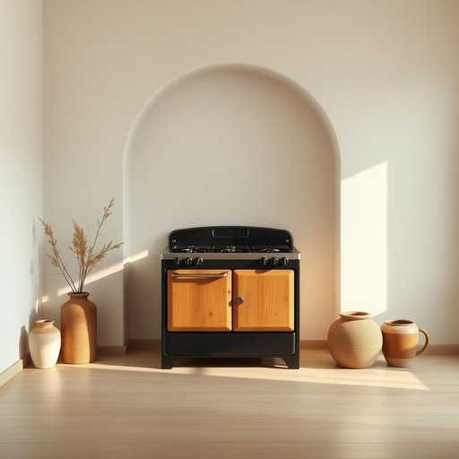

# stove

<h1 style="font-size: 2.5em; font-weight: 300; letter-spacing: 2px; margin: 0; color: #2c3e50;">
/stoʊv/
</h1>

---

---

## 例句

After realizing that the old stove, which had been inherited from her grandmother, was leaking gas despite numerous repairs, she decided to replace it immediately while also researching more energy-efficient models that could reduce their household expenses.

*After(/ˈæftər/) realizing(/ˈriəˌlaɪzɪŋ/) that(/ðət/) the(/ðə/) old(/oʊld/) stove,(/stoʊv,/) which(/wɪʧ/) had(/hæd/) been(/bɪn/) inherited(/ˌɪnˈhɛrətɪd/) from(/frəm/) her(/hər/) grandmother,(/ˈgrændˌməðər,/) was(/wɑz/) leaking(/ˈlikɪŋ/) gas(/gæs/) despite(/dɪˈspaɪt/) numerous(/ˈnumərəs/) repairs,(/rɪˈpɛrz,/) she(/ʃi/) decided(/ˌdɪˈsaɪdɪd/) to(/tɪ/) replace(/ˌriˈpleɪs/) it(/ɪt/) immediately(/ˌɪˈmiˌdiətli/) while(/waɪl/) also(/ˈɔlsoʊ/) researching(/riˈsərʧɪŋ/) more(/mɔr/) energy-efficient(/energy-efficient*/) models(/ˈmɑdəlz/) that(/ðət/) could(/kʊd/) reduce(/rɪˈdus/) their(/ðɛr/) household(/ˈhaʊsˌhoʊld/) expenses.(/ɪkˈspɛnsɪz./)*

**翻译：** 在多次修理无效后，她意识到继承自祖母的旧灶具仍然漏气，便决定立即更换，同时也开始研究更加节能的型号，以减少家庭开支。

---

## 解释

英语单词“stove”作为名词，主要指家居生活中用于加热或烹饪的设备，通常是指带有燃烧器的厨房炉灶或者供暖用的火炉。在具体使用场合和语境中，“stove”常见于描述厨房设施时，如“turn on the stove”（打开炉灶）或“cook on the stove”（用炉灶做饭），也可用于冬季供暖场景，如“wood-burning stove”（燃木火炉）。英语学习者在使用“stove”时应注意其可数性质，通常与冠词连用，并且常用搭配包括“gas stove”（燃气炉）、“electric stove”（电炉）、“wood stove”（木材炉）、“stove top”（炉面）等。此外，“stove”也常出现在复合词或短语中，如“stove pipe”（炉管）等。词源上，“stove”源自古英语“stofa”，本义为被加热的房间，后来演变为指取暖或烹饪用的炉具，这体现了欧洲寒冷气候下的生活习惯。中文语境中，“stove”通常译为“炉子”或“炉灶”，在不同语境下可指厨房用的炉具，也可指供暖用的火炉，意涵稍有差异但均属热源设备。该词没有明显的褒贬色彩，属于中性名词，但因其在家庭生活中的重要性，带有一定的温暖、舒适和生活气息，且在文化上与传统家庭的日常烹饪和取暖密切相关，体现了生活的基本需求和习惯。

---

<small style="color: #999; font-size: 0.9em;">2025-07-17 06:22:40</small>

