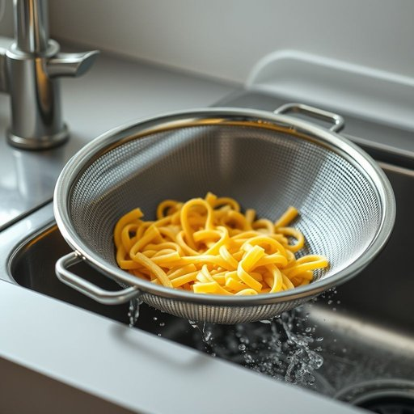

# strainer

<h1 style="font-size: 2.5em; font-weight: 300; letter-spacing: 2px; margin: 0; color: #2c3e50;">
/strainer*/
</h1>

---

---

## 例句

After soaking the pasta, I carefully poured it into the large, stainless steel strainer that sits next to the sink, whose fine mesh is perfect for rinsing vegetables without losing any, while my sister was busy drying the dishes on the rack.

*After(/ˈæftər/) soaking(/ˈsoʊkɪŋ/) the(/ðə/) pasta,(/ˈpɑstə,/) I(/aɪ/) carefully(/ˈkɛrfəli/) poured(/pɔrd/) it(/ɪt/) into(/ˈɪntu/) the(/ðə/) large,(/lɑrʤ,/) stainless(/ˈsteɪnləs/) steel(/stil/) strainer(/strainer*/) that(/ðət/) sits(/sɪts/) next(/nɛkst/) to(/tɪ/) the(/ðə/) sink,(/sɪŋk,/) whose(/huz/) fine(/faɪn/) mesh(/mɛʃ/) is(/ɪz/) perfect(/ˈpərˌfɪkt/) for(/fər/) rinsing(/ˈrɪnsɪŋ/) vegetables(/ˈvɛʤtəbəlz/) without(/wɪˈθaʊt/) losing(/ˈluzɪŋ/) any,(/ˈɛni,/) while(/waɪl/) my(/maɪ/) sister(/ˈsɪstər/) was(/wɑz/) busy(/ˈbɪzi/) drying(/draɪɪŋ/) the(/ðə/) dishes(/ˈdɪʃɪz/) on(/ɔn/) the(/ðə/) rack.(/ræk./)*

**翻译：** 把意大利面泡好后，我小心地倒入放在水槽旁的大号不锈钢滤网中，它的细密网眼非常适合冲洗蔬菜，既干净又不易遗失，而此时我妹妹正忙着把碗碟擦干放在架子上。

---

## 解释

“strainer”作为家居生活用品中的名词，指的是一种过滤或滤水用的器具，通常用于厨房中滤除固体杂质，如滤茶叶、滤汤渣或沥干蔬菜水分等场合。例如，烹饪时用“strainer”过滤面粉中的颗粒，或用来滤去煮面后的水。英语学习者在使用“strainer”时需注意，这个词通常作可数名词，复数形式为“strainers”，且常与动词如“use”、“rinse”、“drain”搭配，表达“使用过滤器”、“用过滤器冲洗”等动作。另外，常见短语如“tea strainer”（茶隔）或“sink strainer”（水槽过滤网）是固定搭配，便于精准表达具体用途。词源方面，“strainer”来源于动词“strain”，意为“过滤、拉紧”，源自中古英语，体现其功能即“通过限制性孔径来筛选”。在中文语境中，“strainer”通常被译为“滤器”、“滤网”或“滤器具”，强调其过滤功能，且用词较为中性，无特殊褒贬色彩或文化内涵，纯粹描述一种家用厨房工具。因此，准确理解和使用“strainer”有助于掌握厨房用具相关词汇及其实际应用。

---

<small style="color: #999; font-size: 0.9em;">2025-07-17 06:22:40</small>

