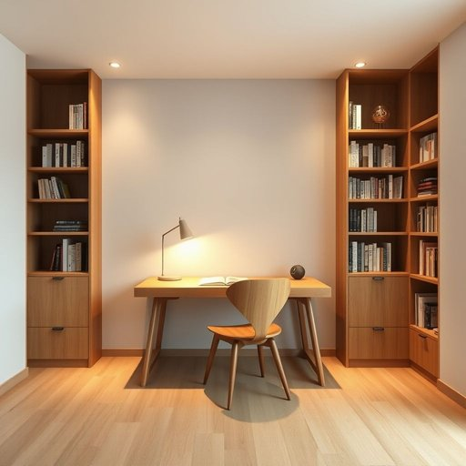

# study

<h1 style="font-size: 2.5em; font-weight: 300; letter-spacing: 2px; margin: 0; color: #2c3e50;">
/ˈstədi/
</h1>

---

---

## 例句

After tidying up the cluttered bookshelves and replacing the worn-out lamp with a more modern one, she finally transformed the little study at the back of the house—which, until recently, had been nothing more than a dusty storage room filled with old furniture—into a cozy and well-lit workspace perfect for writing and reading during the quiet evenings.

*After(/ˈæftər/) tidying(/tidying*/) up(/əp/) the(/ðə/) cluttered(/ˈklətərd/) bookshelves(/ˈbʊkˌʃɛlvz/) and(/ənd/) replacing(/rɪˈpleɪsɪŋ/) the(/ðə/) worn-out(/worn-out*/) lamp(/læmp/) with(/wɪθ/) a(/ə/) more(/mɔr/) modern(/ˈmɑdərn/) one,(/wən,/) she(/ʃi/) finally(/ˈfaɪnəli/) transformed(/trænsˈfɔrmd/) the(/ðə/) little(/ˈlɪtəl/) study(/ˈstədi/) at(/æt/) the(/ðə/) back(/bæk/) of(/əv/) the(/ðə/) house—which,(/house—which*,/) until(/ənˈtɪl/) recently,(/ˈrisəntli,/) had(/hæd/) been(/bɪn/) nothing(/ˈnəθɪŋ/) more(/mɔr/) than(/ðən/) a(/ə/) dusty(/ˈdəsti/) storage(/ˈstɔrɪʤ/) room(/rum/) filled(/fɪld/) with(/wɪθ/) old(/oʊld/) furniture—into(/furniture—into*/) a(/ə/) cozy(/ˈkoʊzi/) and(/ənd/) well-lit(/well-lit*/) workspace(/workspace*/) perfect(/ˈpərˌfɪkt/) for(/fər/) writing(/ˈraɪtɪŋ/) and(/ənd/) reading(/ˈrɛdɪŋ/) during(/ˈdʊrɪŋ/) the(/ðə/) quiet(/kwaɪət/) evenings.(/ˈivnɪŋz./)*

**翻译：** 在整理好杂乱的书架并将那盏旧灯换成更现代的灯具后，她终于把房子后面那个原本不过是一间堆满旧家具、布满灰尘的储藏室的小书房，改造成了一个温馨且采光良好的工作空间，非常适合在宁静的夜晚进行写作和阅读。

---

## 解释

英语单词“study”作为名词在家居生活用品场景中，通常指的是书房或专门用于读书、工作的房间，这种空间专为学习、写作或办公设计，环境较为安静，有书桌、椅子、书架等家具。具体使用场合往往出现在描述家庭布局、室内设计或询问家里功能房间时，如“Do you have a study in your house?”表示“你家里有书房吗？”英语学习者在使用“study”作为名词时需注意其单复数形式“study/studies”的变化，以及与定冠词、不定冠词（a study/the study）搭配的习惯用法，此外常见搭配包括“home study”（家庭书房）、“study room”（学习室）、“in the study”（在书房中）等。在词源上，“study”源自拉丁语“studium”，意为努力、热心，经过中古英语演变后不仅指学习行为，也引申为专门学习或工作的地方。在中文语境中，“study”作为居室名词应准确译为“书房”，强调其作为家居功能空间的属性，避免混淆为学习行为或学科等含义。此词在日常无特殊褒贬色彩，但在文化层面有一定的积极意义，象征安静、专注及学识氛围，反映西方家庭注重个人学习空间的生活理念。

---

<small style="color: #999; font-size: 0.9em;">2025-07-17 06:22:40</small>

