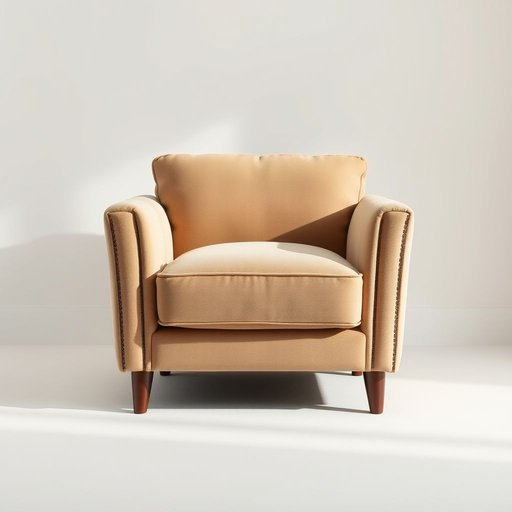

# suede

<h1 style="font-size: 2.5em; font-weight: 300; letter-spacing: 2px; margin: 0; color: #2c3e50;">
/sweɪd/
</h1>

---

---

## 例句

I admired the armchair, whose intricate design and plush cushioning transformed the living room into a sophisticated retreat, though the delicate suede fabric demanded meticulous care to prevent stains and preserve its luxurious texture.

*I(/aɪ/) admired(/ədˈmaɪərd/) the(/ðə/) armchair,(/ˈɑrmˌʧɛr,/) whose(/huz/) intricate(/ˈɪntrəkət/) design(/dɪˈzaɪn/) and(/ənd/) plush(/pləʃ/) cushioning(/ˈkʊʃənɪŋ/) transformed(/trænsˈfɔrmd/) the(/ðə/) living(/ˈlɪvɪŋ/) room(/rum/) into(/ˈɪntu/) a(/ə/) sophisticated(/səˈfɪstɪˌkeɪtəd/) retreat,(/riˈtrit,/) though(/ðoʊ/) the(/ðə/) delicate(/ˈdɛləkət/) suede(/sweɪd/) fabric(/ˈfæbrɪk/) demanded(/dɪˈmændɪd/) meticulous(/məˈtɪkjələs/) care(/kɛr/) to(/tɪ/) prevent(/prɪˈvɛnt/) stains(/steɪnz/) and(/ənd/) preserve(/prɪˈzərv/) its(/ɪts/) luxurious(/ləgˈʒəriəs/) texture.(/ˈtɛksʧər./)*

**翻译：** 我欣赏那把扶手椅，其复杂精美的设计和柔软厚实的垫子，使客厅成了一个雅致的休憩空间，虽说那娇嫩的绒面革面料需细心呵护，以防污渍并保持其奢华质感。

---

## 解释

英语单词“suede”作为名词，在家居生活用品场景中通常指一种质地柔软、表面有绒毛的皮革材料，常用于制作沙发、靠垫、窗帘或装饰性家纺等用品。具体使用场合多见于描述家具面料或布艺装饰，如“一张麂皮沙发”或“麂皮靠垫”。英语学习者在使用时需注意，suede作为不可数名词时不加复数形式，且通常作为材质名词使用，常与名词搭配构成复合名词或短语，如“麂皮夹克”、“麂皮软垫”。此外，suede常用于描述材质特征的形容词短语中，如“麂皮质感”。词源上，suede源自法语“gants de Suède”，意为“瑞典手套”，最初指用瑞典制皮革制作的手套，后来泛指这种表面带有绒毛的软皮革材料。中文语境中，suede一般译为“麂皮”，强调其柔软且带有绒面的特征，区别于光滑的全粒面皮。此词在使用时无特殊褒贬色彩，但由于麂皮材料较为娇嫩，通常给人高档、舒适、温暖的感觉，常带有一定的品质和质感象征，因此在描述家居用品时有优雅和精致的文化含义。

---

<small style="color: #999; font-size: 0.9em;">2025-07-17 06:22:40</small>

