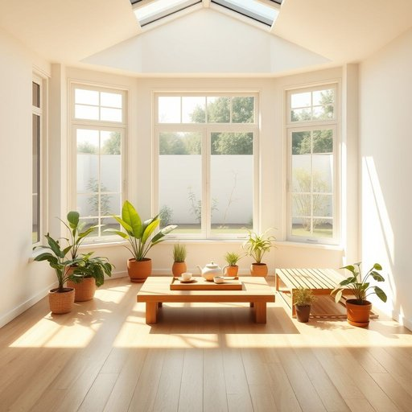

# sun-room

<h1 style="font-size: 2.5em; font-weight: 300; letter-spacing: 2px; margin: 0; color: #2c3e50;">
/sun-room*/
</h1>

---

---

## 例句

After spending the entire morning cleaning the windows and arranging the potted plants, we finally settled into the sun-room, where the warm sunlight filtering through the glass ceiling made it the perfect spot for both reading and enjoying a cup of tea while overlooking the garden.

*After(/ˈæftər/) spending(/ˈspɛndɪŋ/) the(/ðə/) entire(/ɪnˈtaɪər/) morning(/ˈmɔrnɪŋ/) cleaning(/ˈklinɪŋ/) the(/ðə/) windows(/ˈwɪndoʊz/) and(/ənd/) arranging(/ərˈeɪnʤɪŋ/) the(/ðə/) potted(/ˈpɑtɪd/) plants,(/plænts,/) we(/wi/) finally(/ˈfaɪnəli/) settled(/ˈsɛtəld/) into(/ˈɪntu/) the(/ðə/) sun-room,(/sun-room*,/) where(/wɛr/) the(/ðə/) warm(/wɔrm/) sunlight(/ˈsənˌlaɪt/) filtering(/ˈfɪltərɪŋ/) through(/θru/) the(/ðə/) glass(/glæs/) ceiling(/ˈsilɪŋ/) made(/meɪd/) it(/ɪt/) the(/ðə/) perfect(/ˈpərˌfɪkt/) spot(/spɑt/) for(/fər/) both(/boʊθ/) reading(/ˈrɛdɪŋ/) and(/ənd/) enjoying(/ˌɛnˈʤɔɪɪŋ/) a(/ə/) cup(/kəp/) of(/əv/) tea(/ti/) while(/waɪl/) overlooking(/ˈoʊvərˌlʊkɪŋ/) the(/ðə/) garden.(/ˈgɑrdən./)*

**翻译：** 整个上午我们都在清洁窗户和整理盆栽，终于在阳光房里安顿下来。透过玻璃天花板洒下的温暖阳光，使这里成为读书和品茶的理想之地，同时还能俯瞰花园。

---

## 解释

“sun-room”作为名词，指的是住宅中一种设计为采光充足、通常配有大面积玻璃窗或透明屋顶的附属空间，主要用来享受自然阳光和户外景致，常用于休闲、种植盆栽或作为过渡空间，典型使用场合包括家庭住宅、度假房屋或温室花园等环境。在英语学习中，使用“sun-room”时需注意其复合词结构，通常作名词单数或复数形式“sun-rooms”，且多用作可数名词；常见搭配有“build/construct/add a sun-room”（建造阳光房）、“enjoy the sun-room”以及“sun-room furniture”（阳光房家具）；表达时要区分其与类似空间如“porch”（门廊）、“conservatory”（温室）和“solarium”（日光室）的细微区别，因“sun-room”更强调为休闲且充满阳光的居住空间。该词源自英语“sun”（太阳）和“room”（房间）的组合，直译即“阳光房间”，反映20世纪现代建筑注重采光与室内外融合的设计理念，起始于欧美住宅设计的流行趋势中。中文一般准确翻译为“阳光房”或“采光房”，强调其作为住宅附加的、专门享受阳光的功能性房间，在中文语境中通常带有积极、舒适、休闲的含义，没有明显褒贬色彩，但根据具体设计和使用环境，可能关联到房地产配置中的生活品质提升。

---

<small style="color: #999; font-size: 0.9em;">2025-07-17 06:22:40</small>

