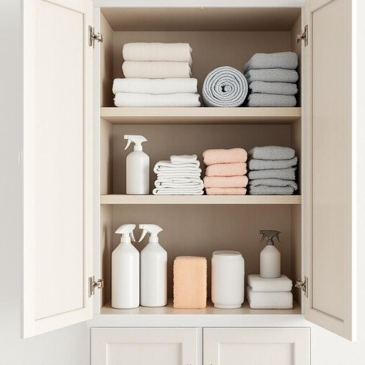

# supply

<h1 style="font-size: 2.5em; font-weight: 300; letter-spacing: 2px; margin: 0; color: #2c3e50;">
/səˈplaɪ/
</h1>

---

---

## 例句

Given the dwindling supply of cleaning products we have in the cupboard, which includes everything from disinfectant sprays to microfiber cloths, I think it’s high time we placed an order online before we run out completely and can't keep the house as tidy as we usually do.

*Given(/ˈgɪvɪn/) the(/ðə/) dwindling(/dˈwɪndəlɪŋ/) supply(/səˈplaɪ/) of(/əv/) cleaning(/ˈklinɪŋ/) products(/ˈprɑdəkts/) we(/wi/) have(/hæv/) in(/ɪn/) the(/ðə/) cupboard,(/ˈkəbərd,/) which(/wɪʧ/) includes(/ˌɪnˈkludz/) everything(/ˈɛvriˌθɪŋ/) from(/frəm/) disinfectant(/dɪsɪnˈfɛktənt/) sprays(/spreɪz/) to(/tɪ/) microfiber(/microfiber*/) cloths,(/klɔθs,/) I(/aɪ/) think(/θɪŋk/) it’s(/it’s*/) high(/haɪ/) time(/taɪm/) we(/wi/) placed(/pleɪst/) an(/ən/) order(/ˈɔrdər/) online(/ˈɔnˌlaɪn/) before(/ˌbiˈfɔr/) we(/wi/) run(/rən/) out(/aʊt/) completely(/kəmˈplitli/) and(/ənd/) can't(/kænt/) keep(/kip/) the(/ðə/) house(/haʊs/) as(/ɛz/) tidy(/ˈtaɪdi/) as(/ɛz/) we(/wi/) usually(/ˈjuʒəwəli/) do.(/du./)*

**翻译：** 鉴于我们橱柜中清洁用品的存量日渐减少，涵盖了从消毒喷雾到超细纤维布各类物品，我认为现在正是时候在线下单补货，以免完全用尽，导致无法像往常那样保持家中整洁。

---

## 解释

英语单词'supply'在家居生活用品场景中作为名词，通常指“供应量”或“生活必需品的储备”，例如家里的清洁用品、水果蔬菜等的库存或补给。具体使用场合包括谈论家庭用品的储备情况、购买清单、日常补货等，如“we need to check the supply of kitchen essentials”（我们需要检查厨房必需品的库存）。英语学习者在使用名词形式的'supply'时需注意它通常是不可数名词，也可作可数名词表示一次供应或一批补给，常见搭配包括“supply of + 物品”如“supply of groceries”（食品供应）、“water supply”（供水），以及“in short supply”（短缺）等表达，语法上通常用作单数，谓语动词需一致。此外，"supply"的词源源自拉丁语“supplere”，意指“填补、补充”，这一背景帮助理解其“补给、供应”的含义。在中文语境中，'supply'名词常被译为“供应”、“供给”或“储备”，根据具体语境可理解为家庭所需物品的存量或供应状态，通常呈中性，既不褒义也无贬义，但在表示“in short supply”时带有不足、匮乏的负面含义。总体而言，'supply'在家居生活用品中强调的是资源或物品的可利用状态和补充保障，是日常生活中表达物品储备和供需关系的重要词汇。

---

<small style="color: #999; font-size: 0.9em;">2025-07-17 06:22:40</small>

