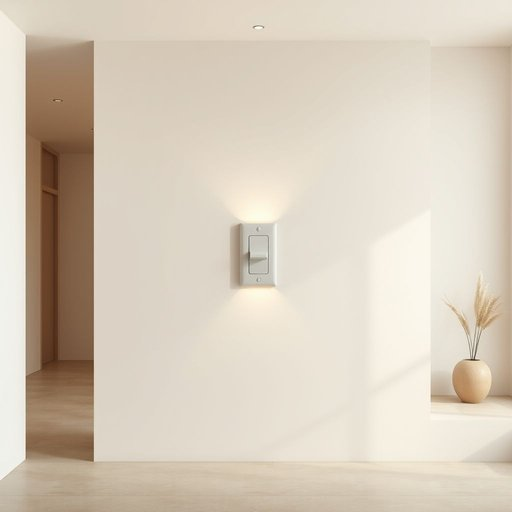

# switch

<h1 style="font-size: 2.5em; font-weight: 300; letter-spacing: 2px; margin: 0; color: #2c3e50;">
/swɪʧ/
</h1>

---

---

## 例句

Could you please check if the light switch by the doorway, which controls both the hallway and the living room lamps, is turned off before we leave, as it’s been acting up recently and causing the lights to flicker intermittently?

*Could(/kʊd/) you(/ju/) please(/pliz/) check(/ʧɛk/) if(/ɪf/) the(/ðə/) light(/laɪt/) switch(/swɪʧ/) by(/baɪ/) the(/ðə/) doorway,(/ˈdɔrˌweɪ,/) which(/wɪʧ/) controls(/kənˈtroʊlz/) both(/boʊθ/) the(/ðə/) hallway(/ˈhɔlˌweɪ/) and(/ənd/) the(/ðə/) living(/ˈlɪvɪŋ/) room(/rum/) lamps,(/læmps,/) is(/ɪz/) turned(/tərnd/) off(/ɔf/) before(/ˌbiˈfɔr/) we(/wi/) leave,(/liv,/) as(/ɛz/) it’s(/it’s*/) been(/bɪn/) acting(/ˈæktɪŋ/) up(/əp/) recently(/ˈrisəntli/) and(/ənd/) causing(/ˈkɔzɪŋ/) the(/ðə/) lights(/laɪts/) to(/tɪ/) flicker(/ˈflɪkər/) intermittently?(/ˌɪntərˈmɪtəntli?/)*

**翻译：** 请您在我们离开前确认一下门口控制走廊和客厅灯的开关是否已关闭，最近它时常出问题，导致灯光时明时暗。

---

## 解释

英语单词“switch”作为名词，在家居生活用品的语境中主要指的是电器或灯具上的开关，用于控制电路的通断，从而实现开关灯、打开或关闭电器设备的功能。具体使用场合通常包括墙壁上的灯开关、家用电器的启动按钮或用于切换不同电源状态的控制装置。英语学习者在使用“switch”作名词时需注意其单复数形式（switch/switches），以及常见搭配，如“light switch”（灯开关）、“power switch”（电源开关）、“switch on/off”（开关动作）等，另外“switch”还常用于动词，但作为名词时多指物理装置。词源方面，“switch”源自中古英语“swichen”，原意为快速移动或挥动，后来引申为通过快速动作控制设备状态的装置。中文语境中，“switch”准确译为“开关”，强调其控制电路通断的功能，无褒贬色彩，属于中性词汇，日常生活中非常常见且重要，几乎是每个家庭电气设备必备的基本组成部分，理解这一点有助于更好地掌握其具体应用和搭配。

---

<small style="color: #999; font-size: 0.9em;">2025-07-17 06:22:40</small>

