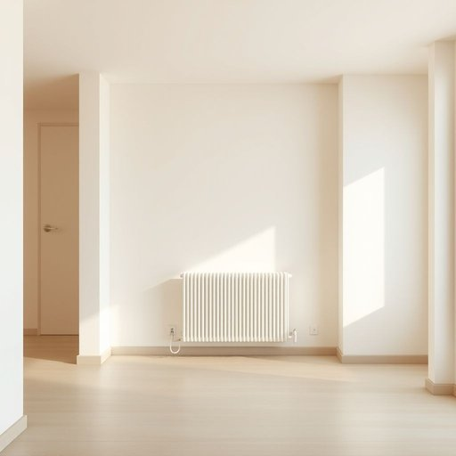

# system

<h1 style="font-size: 2.5em; font-weight: 300; letter-spacing: 2px; margin: 0; color: #2c3e50;">
/ˈsɪstəm/
</h1>

---

---

## 例句

The heating system in the apartment's infrastructure requires regular maintenance to ensure optimal performance and energy efficiency, which ultimately affects the residents' comfort and utility expenses.

*The(/ðə/) heating(/ˈhitɪŋ/) system(/ˈsɪstəm/) in(/ɪn/) the(/ðə/) apartment's(/apartment's*/) infrastructure(/ˌɪnfrəˈstrəkʧər/) requires(/rikˈwaɪərz/) regular(/ˈrɛgjələr/) maintenance(/ˈmeɪntənəns/) to(/tɪ/) ensure(/ɪnˈʃʊr/) optimal(/ˈɑptɪməl/) performance(/pərˈfɔrməns/) and(/ənd/) energy(/ˈɛnərʤi/) efficiency,(/ɪˈfɪʃənsi,/) which(/wɪʧ/) ultimately(/ˈəltəmətli/) affects(/əˈfɛkts/) the(/ðə/) residents'(/ˈrɛzɪdənts'/) comfort(/ˈkəmfərt/) and(/ənd/) utility(/juˈtɪləti/) expenses.(/ɪkˈspɛnsɪz./)*

**翻译：** 公寓基础设施中的供暖系统需要定期维护，以确保其最佳性能和能源效率，从而最终影响居民的舒适度和公用费用。

---

## 解释

英语单词“system”在家居生活用品场景中作为名词，通常指的是由多个部分组成、协同工作以完成特定功能的整体装置或结构，例如家庭供暖系统（heating system）、安全报警系统（security system）、照明系统（lighting system）或水净化系统（water purification system）等。具体使用场合多见于描述家中各种机械或电子设备的配置和工作原理，强调这些设备之间的协调运行。英语学习者在使用“system”时应注意其不可数和可数用法，通常表示整体结构时可数，如"a heating system"，而泛指系统概念时可不可数；常见的搭配有“system design”、“system installation”、“system maintenance”等，表达时可结合具体功能部分使用“control system”、“drainage system”等，此外，“system”可作为复合词的组成部分，如“sound system”（音响系统）。词源上，“system”源自希腊语“systēma”，意为“组织起来的整体”，通过拉丁语“systema”传入英语，原意强调各部分的有机连接和合作。在中文语境中，“system”通常准确翻译为“系统”，既指一组相关的装置或机构，有时也泛指某种方法或规程，语义中性，无明显褒贬色彩，但在特定语境下强调系统的高效、规范性时带有积极评价，反之若指系统故障则带有负面含义。总的来说，在家居生活用品领域，“system”强调的是多部件协同功能的整体理念，理解时应结合具体用途和结构层次灵活翻译和应用。

---

<small style="color: #999; font-size: 0.9em;">2025-07-17 06:22:40</small>

