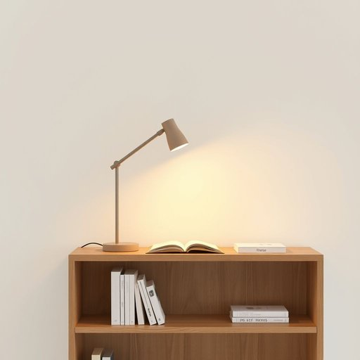

# table-lamp

<h1 style="font-size: 2.5em; font-weight: 300; letter-spacing: 2px; margin: 0; color: #2c3e50;">
/table-lamp*/
</h1>

---

---

## 例句

Could you please move the table-lamp from the corner beside the sofa to the bookshelf, where its adjustable arm and warm, soft glow will be much more effective for reading in the evenings when natural light fades?

*Could(/kʊd/) you(/ju/) please(/pliz/) move(/muv/) the(/ðə/) table-lamp(/table-lamp*/) from(/frəm/) the(/ðə/) corner(/ˈkɔrnər/) beside(/ˌbiˈsaɪd/) the(/ðə/) sofa(/ˈsoʊfə/) to(/tɪ/) the(/ðə/) bookshelf,(/ˈbʊkˌʃɛlf,/) where(/wɛr/) its(/ɪts/) adjustable(/əˈʤəstəbəl/) arm(/ɑrm/) and(/ənd/) warm,(/wɔrm,/) soft(/sɔft/) glow(/gloʊ/) will(/wɪl/) be(/bi/) much(/məʧ/) more(/mɔr/) effective(/ˈifɛktɪv/) for(/fər/) reading(/ˈrɛdɪŋ/) in(/ɪn/) the(/ðə/) evenings(/ˈivnɪŋz/) when(/wɪn/) natural(/ˈnæʧərəl/) light(/laɪt/) fades?(/feɪdz?/)*

**翻译：** 请您将角落里沙发旁的台灯移到书架上，那里的可调节灯臂和温暖柔和的灯光，在傍晚自然光渐隐时阅读将更加舒适有效。

---

## 解释

“table-lamp”作为名词，指的是放置在桌面上的小型台灯，主要用于提供局部照明，常见于家庭、办公室或学习环境中，用来照明书桌、床头柜或工作台，便于阅读、写作或其他细节操作。使用时，英语学习者应注意该词为复合名词，通常以连字符连接，但也有时简写为“table lamp”，且作为非可数或可数名词均可，复数形式为“table-lamps”或“table lamps”，其搭配常见有“turn on/off the table lamp”（开/关台灯）、“adjust the table lamp”（调整台灯）等表达。词源上，“table”意为“桌子”，“lamp”意为“灯”，合成词直观表达了其功能与位置，起源于电灯普及后，为突出提供局部照明的设备而形成。汉语中对应的准确翻译为“台灯”，既强调了其桌面使用的场景，又区分于吊灯、落地灯等其他灯具。该词本身无特别褒贬色彩，属于中性词汇，普遍应用于正式与口语语境，有助于准确传达居家或办公环境中局部照明设备的概念。

---

<small style="color: #999; font-size: 0.9em;">2025-07-17 06:22:40</small>

