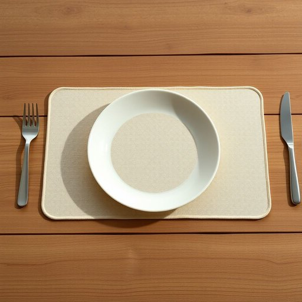

# table-mat

<h1 style="font-size: 2.5em; font-weight: 300; letter-spacing: 2px; margin: 0; color: #2c3e50;">
/table-mat*/
</h1>

---

---

## 例句

Could you please make sure to lay out the table-mats, which are the ones with the intricate floral patterns and waterproof backing, before setting the dining table for dinner, as they not only protect the surface from heat and spills but also add a charming, homely touch that complements the rustic wooden furniture perfectly?

*Could(/kʊd/) you(/ju/) please(/pliz/) make(/meɪk/) sure(/ʃʊr/) to(/tɪ/) lay(/leɪ/) out(/aʊt/) the(/ðə/) table-mats,(/table-mats*,/) which(/wɪʧ/) are(/ər/) the(/ðə/) ones(/wənz/) with(/wɪθ/) the(/ðə/) intricate(/ˈɪntrəkət/) floral(/ˈflɔrəl/) patterns(/ˈpætərnz/) and(/ənd/) waterproof(/ˈwɔtərˌpruf/) backing,(/ˈbækɪŋ,/) before(/ˌbiˈfɔr/) setting(/ˈsɛtɪŋ/) the(/ðə/) dining(/ˈdaɪnɪŋ/) table(/ˈteɪbəl/) for(/fər/) dinner,(/ˈdɪnər,/) as(/ɛz/) they(/ðeɪ/) not(/nɑt/) only(/ˈoʊnli/) protect(/prəˈtɛkt/) the(/ðə/) surface(/ˈsərfəs/) from(/frəm/) heat(/hit/) and(/ənd/) spills(/spɪlz/) but(/bət/) also(/ˈɔlsoʊ/) add(/æd/) a(/ə/) charming,(/ˈʧɑrmɪŋ,/) homely(/ˈhoʊmli/) touch(/təʧ/) that(/ðət/) complements(/ˈkɑmpləmənts/) the(/ðə/) rustic(/ˈrəstɪk/) wooden(/ˈwʊdən/) furniture(/ˈfərnɪʧər/) perfectly?(/ˈpərfəktli?/)*

**翻译：** 请您务必在摆放晚餐餐桌前，将那些带有精致花卉图案且具防水背衬的餐垫铺好，因为它们不仅能够保护桌面免受高温和液体溅洒的损害，还能增添一份迷人而温馨的氛围，与质朴的木质家具相得益彰。

---

## 解释

“table-mat”作为名词在家居生活用品的语境中指的是餐垫，即放在餐桌上用于保护桌面、避免餐具或餐盘直接接触桌面的垫子，通常由布料、塑料、纸张或其他材料制成，具体使用场合多见于家庭用餐、餐厅或茶歇时间，既起到装饰作用，也便于清洁。英语学习者在使用“table-mat”时应注意其为可数名词，复数形式为“table-mats”，常与动词如“place”、“put”、“use”搭配，表达方式如“put a table-mat on the table”或“use a table-mat to protect the surface”，此外，它通常与餐桌相关词汇连用，如“dining table”、“cutlery”和“plates”。该词源自“table”（桌子）和“mat”（垫子）两个英语基本词汇的组合，直观表达其功能属性，来源清晰且无特殊隐喻或文化负面色彩。在中文语境中，“table-mat”准确翻译为“餐垫”，指的是用在餐桌上的垫席，强调其保护和装饰的双重功能，通常与餐桌布（tablecloth）区别开来，后者是覆盖整个桌面的布料，而餐垫通常是单个使用放置在座位处，不具有特别的褒贬含义，属于中性且实用的家居用品词汇。

---

<small style="color: #999; font-size: 0.9em;">2025-07-17 06:22:40</small>

