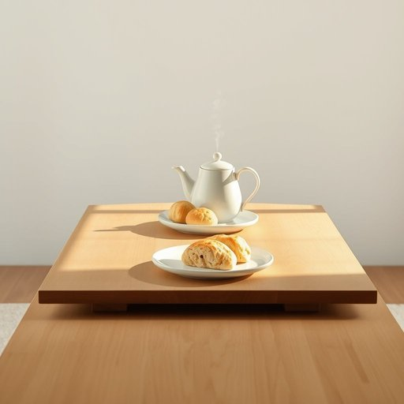

# table

<h1 style="font-size: 2.5em; font-weight: 300; letter-spacing: 2px; margin: 0; color: #2c3e50;">
/ˈteɪbəl/
</h1>

---

---

## 例句

After clearing all the clutter from the dining table, which had been piled high with magazines, children’s drawings, and yesterday’s mail, she finally placed the freshly brewed teapot and a plate of homemade scones in the centre, inviting everyone to gather round and enjoy a proper afternoon tea.

*After(/ˈæftər/) clearing(/ˈklɪrɪŋ/) all(/ɔl/) the(/ðə/) clutter(/ˈklətər/) from(/frəm/) the(/ðə/) dining(/ˈdaɪnɪŋ/) table,(/ˈteɪbəl,/) which(/wɪʧ/) had(/hæd/) been(/bɪn/) piled(/paɪld/) high(/haɪ/) with(/wɪθ/) magazines,(/ˈmægəˌzinz,/) children’s(/children’s*/) drawings,(/drɔɪŋz,/) and(/ənd/) yesterday’s(/yesterday’s*/) mail,(/meɪl,/) she(/ʃi/) finally(/ˈfaɪnəli/) placed(/pleɪst/) the(/ðə/) freshly(/ˈfrɛʃli/) brewed(/brud/) teapot(/ˈtiˌpɑt/) and(/ənd/) a(/ə/) plate(/pleɪt/) of(/əv/) homemade(/ˈhoʊˈmeɪd/) scones(/skoʊnz/) in(/ɪn/) the(/ðə/) centre,(/ˈsɛntər,/) inviting(/ˌɪnˈvaɪtɪŋ/) everyone(/ˈɛvriˌwən/) to(/tɪ/) gather(/ˈgæðər/) round(/raʊnd/) and(/ənd/) enjoy(/ˌɛnˈʤɔɪ/) a(/ə/) proper(/ˈprɑpər/) afternoon(/ˌæftərˈnun/) tea.(/ti./)*

**翻译：** 清理掉堆满杂志、儿童画作和昨天的邮件的餐桌后，她终于将刚泡好的茶壶和一盘自制烤饼放在中央，邀请大家围坐一堂，共享一场正宗的下午茶。

---

## 解释

英语单词“table”作为名词在家居生活用品的语境中，主要指的是一种有平坦表面和支撑结构的家具，用于放置物品、吃饭、工作或装饰。具体使用场合多见于厨房、餐厅、客厅或办公室，例如“dining table”（餐桌）、“coffee table”（咖啡桌）等。英语学习者在使用“table”时，应注意它是可数名词，通常用复数形式“tables”表示多个，并且常与具体用途或形容词搭配，如“wooden table”（木桌）、“round table”（圆桌）、“study table”（书桌）。此外，“table”在某些固定表达如“on the table”表示某事被提出讨论时，含义有所扩展，需区分家具和抽象用法。词源上，“table”源自拉丁语“tabula”，意为板子或平板，与现代桌子的平面特征相符合。中文中“table”对应“桌子”，指的是家居中常见的桌面家具，涵盖餐桌、书桌、茶几等类型，翻译时应结合具体类型选择最合适的中文词汇。此词在普通语境中无明显褒贬或特殊文化内涵，属于中性常用词，便于直接理解和应用。

---

<small style="color: #999; font-size: 0.9em;">2025-07-17 06:22:40</small>

