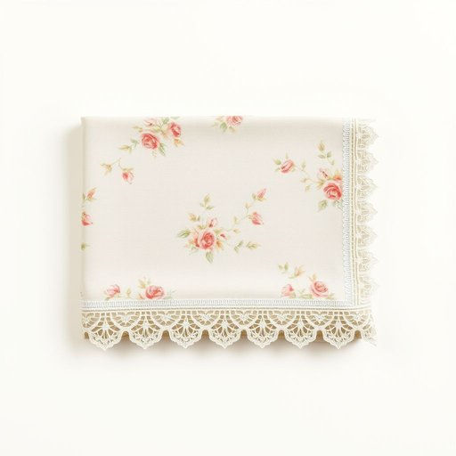

# tablecloth

<h1 style="font-size: 2.5em; font-weight: 300; letter-spacing: 2px; margin: 0; color: #2c3e50;">
/ˈteɪbəlˌklɔθ/
</h1>

---

---

## 例句

Before we set the dining table for tonight’s family dinner, could you please fetch the floral-patterned tablecloth from the cupboard, the one with the intricate lace edging that Mum bought last summer, so it can add a touch of elegance and protect the surface from any accidental spills?

*Before(/ˌbiˈfɔr/) we(/wi/) set(/sɛt/) the(/ðə/) dining(/ˈdaɪnɪŋ/) table(/ˈteɪbəl/) for(/fər/) tonight’s(/tonight’s*/) family(/ˈfæməli/) dinner,(/ˈdɪnər,/) could(/kʊd/) you(/ju/) please(/pliz/) fetch(/fɛʧ/) the(/ðə/) floral-patterned(/floral-patterned*/) tablecloth(/ˈteɪbəlˌklɔθ/) from(/frəm/) the(/ðə/) cupboard,(/ˈkəbərd,/) the(/ðə/) one(/wən/) with(/wɪθ/) the(/ðə/) intricate(/ˈɪntrəkət/) lace(/leɪs/) edging(/ˈɛʤɪŋ/) that(/ðət/) Mum(/məm/) bought(/bɔt/) last(/læst/) summer,(/ˈsəmər,/) so(/soʊ/) it(/ɪt/) can(/kən/) add(/æd/) a(/ə/) touch(/təʧ/) of(/əv/) elegance(/ˈɛləgəns/) and(/ənd/) protect(/prəˈtɛkt/) the(/ðə/) surface(/ˈsərfəs/) from(/frəm/) any(/ˈɛni/) accidental(/ˌæksəˈdɛnəl/) spills?(/spɪlz?/)*

**翻译：** 在我们为今晚的家庭晚餐摆桌子之前，能否请你从橱柜里拿出那条带有花卉图案、妈妈去年夏天买的、边缘有精致蕾丝装饰的桌布？这样既能增添一份优雅，也能保护桌面免受意外溢洒的损害。

---

## 解释

“tablecloth”作为名词，指的是覆盖在餐桌上的布，用于保护桌面或装饰餐桌，常见于家庭、餐厅等用餐场合，尤其是在正式或节日聚餐时使用较多。英语学习者在使用该词时需注意，tablecloth为可数名词，复数形式为tablecloths，前面通常可加不定冠词a或数量词，如a tablecloth, two tablecloths；此外，常见搭配包括“a clean tablecloth”（干净的桌布）、“spread a tablecloth on the table”（在桌上铺桌布）、“a plastic tablecloth”（塑料桌布）等，表达时可配合形容词或材质词丰富含义。该词由“table”（桌子）和“cloth”（布）组成，词源直接反映了其功能性，即用布料覆盖桌子。中文中，tablecloth准确译为“桌布”或“桌巾”，在家居生活用品中具有明确的指代意义，无贬义或褒义色彩，属于中性且日常的家居用品词汇，文化上常与家庭温馨、整洁及待客礼仪相关联。整体而言，tablecloth是描述餐桌布覆盖物的标准表达，学习时重点掌握其可数性质、搭配规则及具体语境使用即可。

---

<small style="color: #999; font-size: 0.9em;">2025-07-17 06:22:40</small>

