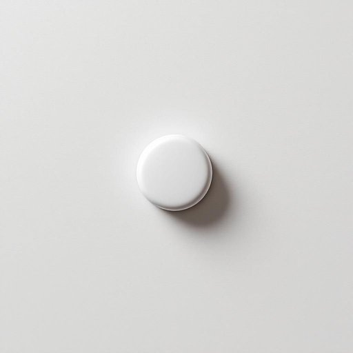

# tablet

<h1 style="font-size: 2.5em; font-weight: 300; letter-spacing: 2px; margin: 0; color: #2c3e50;">
/ˈtæblət/
</h1>

---

---

## 例句

Could you please pass me the tablet that’s charging by the sofa, the one with the cracked screen protector and all my grocery lists saved on it, because I need to check the recipe before we start cooking dinner?

*Could(/kʊd/) you(/ju/) please(/pliz/) pass(/pæs/) me(/mi/) the(/ðə/) tablet(/ˈtæblət/) that’s(/that’s*/) charging(/ˈʧɑrʤɪŋ/) by(/baɪ/) the(/ðə/) sofa,(/ˈsoʊfə,/) the(/ðə/) one(/wən/) with(/wɪθ/) the(/ðə/) cracked(/krækt/) screen(/skrin/) protector(/prəˈtɛktər/) and(/ənd/) all(/ɔl/) my(/maɪ/) grocery(/ˈgroʊsəri/) lists(/lɪsts/) saved(/seɪvd/) on(/ɔn/) it,(/ɪt,/) because(/bɪˈkəz/) I(/aɪ/) need(/nid/) to(/tɪ/) check(/ʧɛk/) the(/ðə/) recipe(/ˈrɛsəpi/) before(/ˌbiˈfɔr/) we(/wi/) start(/stɑrt/) cooking(/ˈkʊkɪŋ/) dinner?(/ˈdɪnər?/)*

**翻译：** 请把沙发边正在充电的那台平板递给我，就是那个屏幕保护贴已经有裂痕、且保存着我所有购物清单的平板，我需要先查看食谱，然后我们才能开始做晚饭。

---

## 解释

英语单词“tablet”在家居生活用品的语境中作为名词主要指形状为扁平且通常较小的固体物品，最常见的是药片或维生素片，这类tablet通常用于家庭药箱中，用于治疗和保健。在具体使用场合如家庭健康护理、日常用药管理或食品保健时会经常遇到这个词。对于英语学习者来说，使用“tablet”时需要注意其单复数变化（单数tablet，复数tablets），以及与具体物品的搭配如“aspirin tablet”（阿司匹林药片）、“vitamin tablets”（维生素片），此外，“tablet”还可指电子产品如平板电脑，但在家居生活用品的语境中应避免混淆。该词源自拉丁语“tabula”，意为小板、写字板，后来演变为指扁平的小片状物品，这一词源背景有助理解其形状特征。中文语境中，“tablet”准确翻译为“药片”或“片剂”，强调其固体、片状的特征，避免与电子设备的“平板电脑”混淆。总体而言，“tablet”在家居生活用品领域通常带有中性用法，无褒贬色彩，体现的是物理形态与用途的具体指称。

---

<small style="color: #999; font-size: 0.9em;">2025-07-17 06:22:40</small>

