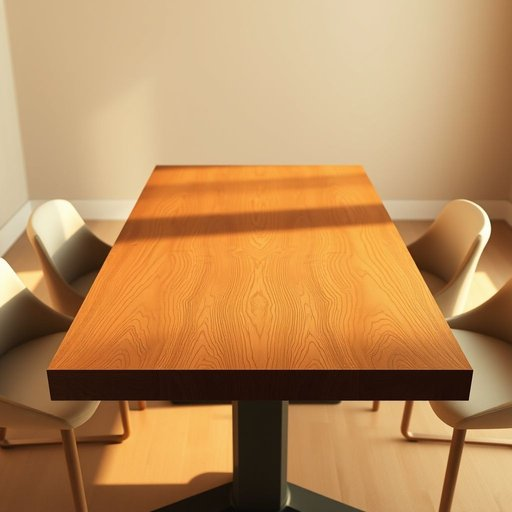

# tabletop

<h1 style="font-size: 2.5em; font-weight: 300; letter-spacing: 2px; margin: 0; color: #2c3e50;">
/ˈteɪbəlˌtɑp/
</h1>

---

---

## 例句

After we cleared the clutter and polished the wooden tabletop, which had stubborn coffee stains despite countless attempts at cleaning, the whole dining room instantly felt warmer and more inviting, making it the perfect spot for family meals and evening conversations.

*After(/ˈæftər/) we(/wi/) cleared(/klɪrd/) the(/ðə/) clutter(/ˈklətər/) and(/ənd/) polished(/ˈpɑlɪʃt/) the(/ðə/) wooden(/ˈwʊdən/) tabletop,(/ˈteɪbəlˌtɑp,/) which(/wɪʧ/) had(/hæd/) stubborn(/ˈstəbərn/) coffee(/ˈkɔfi/) stains(/steɪnz/) despite(/dɪˈspaɪt/) countless(/ˈkaʊntləs/) attempts(/əˈtɛmpts/) at(/æt/) cleaning,(/ˈklinɪŋ,/) the(/ðə/) whole(/hoʊl/) dining(/ˈdaɪnɪŋ/) room(/rum/) instantly(/ˈɪnstəntli/) felt(/fɛlt/) warmer(/ˈwɔrmər/) and(/ənd/) more(/mɔr/) inviting,(/ˌɪnˈvaɪtɪŋ,/) making(/ˈmeɪkɪŋ/) it(/ɪt/) the(/ðə/) perfect(/ˈpərˌfɪkt/) spot(/spɑt/) for(/fər/) family(/ˈfæməli/) meals(/milz/) and(/ənd/) evening(/ˈivnɪŋ/) conversations.(/ˌkɑnvərˈseɪʃənz./)*

**翻译：** 清理完杂物，擦亮了那张多次清洗仍有顽固咖啡渍的木质餐桌后，整个餐厅立刻变得更加温馨宜人，成为了家人共进餐食、夜晚畅谈的理想之地。

---

## 解释

英语单词“tabletop”作为名词在家居生活用品语境中通常指桌面，即桌子的上表面，常用于描述其材质、尺寸、形状或装饰，比如“a wooden tabletop”（一个木制桌面）或“a glass tabletop”（一个玻璃桌面）。具体使用场合多出现在家具描述、室内设计或维修保养时，强调桌面部分而非整体家具结构。英语学习者在使用这个词时需注意，其作为复合名词，前半部分“table”修饰后半部分“top”，整体作名词使用，通常不可数但在某些情况下可数以指不同的桌面类型或具体单个桌面；常见搭配包括“tabletop lamp”（桌面灯）、“tabletop games”（桌面游戏，虽是延伸义但与实物桌面相关）、“tabletop surface”等，表达时应避免与“table”互换混淆。该词源于“table”和“top”的简单合成，表示桌子上部的平面部分，属于直译型合成词，起源于英语日常生活中对家具结构的细分。中文语境中，“tabletop”准确翻译为“桌面”，强调的是桌子的上方平面部分，区别于“桌子”整体。此词无特殊褒贬色彩，也不含文化内涵，属于中性、实用的家具专业用语，因此在表达时应根据语境准确使用，特别是在描述家具的具体部分或相关用品时，以避免歧义。

---

<small style="color: #999; font-size: 0.9em;">2025-07-17 06:22:40</small>

