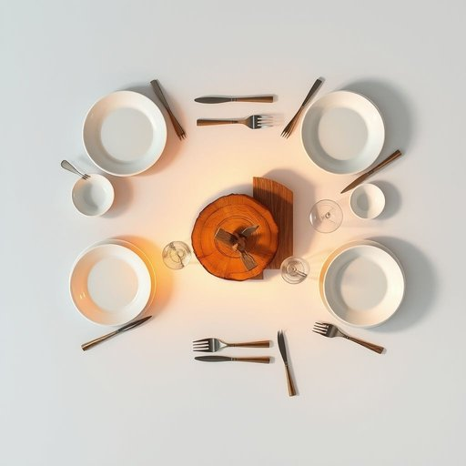

# tableware

<h1 style="font-size: 2.5em; font-weight: 300; letter-spacing: 2px; margin: 0; color: #2c3e50;">
/ˈteɪbəlˌwɛr/
</h1>

---

---

## 例句

Before we set the dining table for tonight’s dinner party, the tableware's elegance distinctly enhances the ambience, showcasing the delicate china plates and polished silver cutlery that perfectly complement the rustic wooden centerpiece made last weekend.

*Before(/ˌbiˈfɔr/) we(/wi/) set(/sɛt/) the(/ðə/) dining(/ˈdaɪnɪŋ/) table(/ˈteɪbəl/) for(/fər/) tonight’s(/tonight’s*/) dinner(/ˈdɪnər/) party,(/ˈpɑrti,/) the(/ðə/) tableware's(/tableware's*/) elegance(/ˈɛləgəns/) distinctly(/dɪˈstɪŋktli/) enhances(/ɛnˈhænsɪz/) the(/ðə/) ambience,(/ˈæmbiəns,/) showcasing(/ˈʃoʊkeɪsɪŋ/) the(/ðə/) delicate(/ˈdɛləkət/) china(/ˈʧaɪnə/) plates(/pleɪts/) and(/ənd/) polished(/ˈpɑlɪʃt/) silver(/ˈsɪlvər/) cutlery(/ˈkətləri/) that(/ðət/) perfectly(/ˈpərfəktli/) complement(/ˈkɑmpləmənt/) the(/ðə/) rustic(/ˈrəstɪk/) wooden(/ˈwʊdən/) centerpiece(/ˈsɛntərˌpis/) made(/meɪd/) last(/læst/) weekend.(/ˈwiˌkɪnd./)*

**翻译：** 在我们为今晚的晚宴布置餐桌之前，精致的餐具为氛围增添了独特的优雅，展示出细腻的瓷盘和光亮的银质餐具，它们与上周末制作的质朴木质桌饰相得益彰。

---

## 解释

英语单词“tableware”作为名词，主要指用于餐桌上的各类用具，典型使用场合包括家庭用餐、餐厅服务、宴会布置等涉及饮食和餐具的语境中，强调的是食物的盛装、摆放和食用所需的器皿，如盘子、碗、杯子、刀叉勺等。英语学习者需注意“tableware”通常不可数，也就是说一般不使用复数形式“tablewares”，而是以整体概念出现，搭配词常见有“set of tableware”（一套餐具）、“buy tableware”（购买餐具）等。此外，“tableware”作为集合名词，可以与形容词连用如“fine tableware”（精致餐具）、“ceramic tableware”（陶瓷餐具）。词源方面，“tableware”由“table”（桌子）与“ware”（器具、器皿）组成，表现了其本质为“餐桌器具”，最早源于中世纪英语中“ware”用于指代各种器皿的用法，反映了其功能性和使用环境。中文语境中，“tableware”准确翻译为“餐具”或“餐桌用具”，涵盖的范围比单纯的“餐具”更广泛，包括餐桌上所有相关器皿，与“厨具”（厨房用具）相区别。该词无明显褒贬色彩，属于中性词，在西方文化中“tableware”往往还隐含着用餐礼仪和生活品质的暗示，因此在正式或高档场合谈论“fine tableware”可能反映出对生活品味的注重。

---

<small style="color: #999; font-size: 0.9em;">2025-07-17 06:22:40</small>

