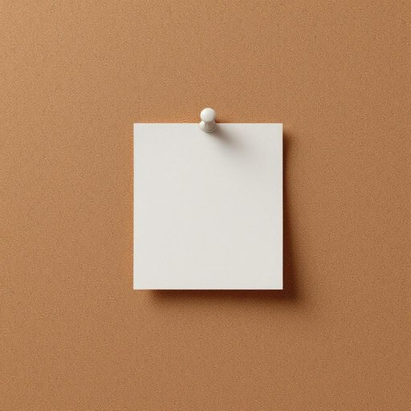

# tack

<h1 style="font-size: 2.5em; font-weight: 300; letter-spacing: 2px; margin: 0; color: #2c3e50;">
/tæk/
</h1>

---

---

## 例句

Could you please check if there's a box of drawing tacks in the study drawer, next to the old stapler and the stack of unopened mail, because I need to pin this important note on the corkboard before the guests arrive this afternoon?

*Could(/kʊd/) you(/ju/) please(/pliz/) check(/ʧɛk/) if(/ɪf/) there's(/ðɛrz/) a(/ə/) box(/bɑks/) of(/əv/) drawing(/drɔɪŋ/) tacks(/tæks/) in(/ɪn/) the(/ðə/) study(/ˈstədi/) drawer,(/drɔr,/) next(/nɛkst/) to(/tɪ/) the(/ðə/) old(/oʊld/) stapler(/ˈsteɪpələr/) and(/ənd/) the(/ðə/) stack(/stæk/) of(/əv/) unopened(/əˈnoʊpənd/) mail,(/meɪl,/) because(/bɪˈkəz/) I(/aɪ/) need(/nid/) to(/tɪ/) pin(/pɪn/) this(/ðɪs/) important(/ˌɪmˈpɔrtənt/) note(/noʊt/) on(/ɔn/) the(/ðə/) corkboard(/corkboard*/) before(/ˌbiˈfɔr/) the(/ðə/) guests(/gɛsts/) arrive(/əraɪv/) this(/ðɪs/) afternoon?(/ˌæftərˈnun?/)*

**翻译：** 请帮忙查看一下书房抽屉里是否有一盒图钉，就放在旧订书机和那堆未打开的信件旁边，因为我需要在客人下午到来之前，把这张重要便条别在软木板上。

---

## 解释

英语单词“tack”在家居生活用品的语境中作为名词，通常指的是小钉子或图钉，这类钉子头部较平且小，常用于将纸张、布料等固定在软质表面如软木板、墙面或家具上，使用场合多见于家庭装饰、手工制作或简单修理中。学习者在使用“tack”时应注意其单数和复数形式，单数为“tack”，复数一般为“tacks”，且通常与动词“put up（贴出）”、“hammer in（钉入）”等搭配使用，如“to put a tack on the corkboard”（把图钉钉在软木板上），此外需区分“tack”与“thumbtack”（主要指带有平头的图钉）及“pushpin”（美式英语中常用，类似于图钉）等相关词汇。词源方面，“tack”源自中古英语，最初意指小钉，可能与古法语“taque”相关联，体现了固定或附着物品的本义。在中文语境中，“tack”作为名词多翻译为“图钉”或“小钉”，表达精确且无贬义，属于中性词汇，广泛用于描述日常生活中的固定工具，无特殊文化色彩，但使用时需根据具体场合选词以便更准确传达意思，例如“图钉”偏重办公或布告板之用，小钉则泛指更多种类的细小钉子。

---

<small style="color: #999; font-size: 0.9em;">2025-07-17 06:22:40</small>

