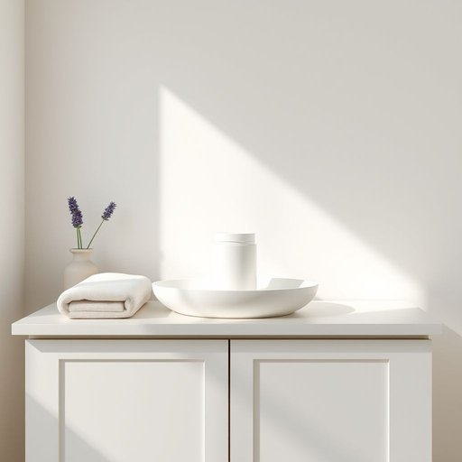

# talc

<h1 style="font-size: 2.5em; font-weight: 300; letter-spacing: 2px; margin: 0; color: #2c3e50;">
/tælk/
</h1>

---

---

## 例句

Could you please pass me the talc that's kept on the top shelf of the bathroom cabinet, the one with the lavender scent, because after I finish tidying the kids' playroom and wiping down the dusty shelves, I want to freshen up and avoid that sticky feeling on my skin?

*Could(/kʊd/) you(/ju/) please(/pliz/) pass(/pæs/) me(/mi/) the(/ðə/) talc(/tælk/) that's(/ðæts/) kept(/kɛpt/) on(/ɔn/) the(/ðə/) top(/tɔp/) shelf(/ʃɛlf/) of(/əv/) the(/ðə/) bathroom(/ˈbæθˌrum/) cabinet,(/ˈkæbənət,/) the(/ðə/) one(/wən/) with(/wɪθ/) the(/ðə/) lavender(/ˈlævəndər/) scent,(/sɛnt,/) because(/bɪˈkəz/) after(/ˈæftər/) I(/aɪ/) finish(/ˈfɪnɪʃ/) tidying(/tidying*/) the(/ðə/) kids'(/kɪdz'/) playroom(/ˈpleɪˌrum/) and(/ənd/) wiping(/ˈwaɪpɪŋ/) down(/daʊn/) the(/ðə/) dusty(/ˈdəsti/) shelves,(/ʃɛlvz,/) I(/aɪ/) want(/wɔnt/) to(/tɪ/) freshen(/ˈfrɛʃən/) up(/əp/) and(/ənd/) avoid(/əˈvɔɪd/) that(/ðət/) sticky(/ˈstɪki/) feeling(/ˈfilɪŋ/) on(/ɔn/) my(/maɪ/) skin?(/skɪn?/)*

**翻译：** 请你帮我拿一下浴室柜顶层那个带薰衣草香味的爽身粉好吗？因为我整理完孩子们的游乐室，擦拭了那些积满灰尘的架子后，想用它清爽一下，避免皮肤感到黏腻。

---

## 解释

单词“talc”在家居生活用品的语境中作为名词，指的是“滑石粉”或“滑石”，是一种细腻的矿物质粉末，常用于婴儿爽身粉、身体护理用品以及防潮吸湿产品中，起到吸湿、防止皮肤摩擦或保持干爽的作用。英语学习者在使用“talc”时应注意其不可数名词属性，通常不用于复数形式，常见搭配有“talc powder”（滑石粉）、“baby talc”（婴儿滑石粉）等，表达时多与物质名词搭配，句子中通常作主语或宾语，无需加冠词时强调泛指。该词源自拉丁语“talks”、希腊语“talks”，最终源于阿拉伯语“talq”，指代矿物本身，是一种自然产物，因此语义较为中性，无褒贬或特殊文化色彩。在中文中，“talc”准确翻译为“滑石”或“滑石粉”，理解时应结合具体产品属性，避免与其他粉状物混淆，特别是在涉及婴儿用品或化妆品时，更应强调其安全性和纯净度。

---

<small style="color: #999; font-size: 0.9em;">2025-07-17 06:22:40</small>

