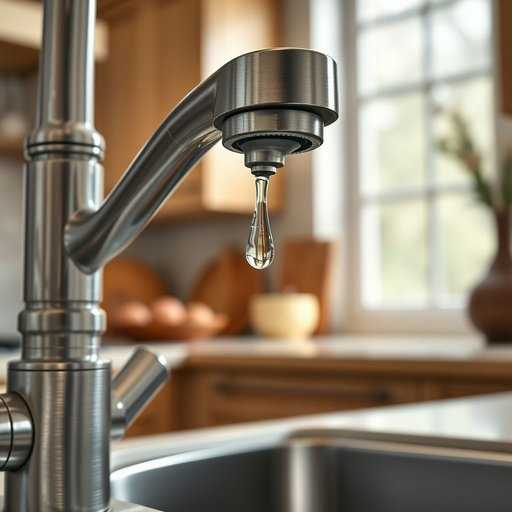

# tap

<h1 style="font-size: 2.5em; font-weight: 300; letter-spacing: 2px; margin: 0; color: #2c3e50;">
/tæp/
</h1>

---

---

## 例句

I noticed that the kitchen tap, which we installed last year because the old one kept leaking, has started dripping again despite our attempts to tighten the washer and clean the aerator thoroughly.

*I(/aɪ/) noticed(/ˈnoʊtɪst/) that(/ðət/) the(/ðə/) kitchen(/ˈkɪʧən/) tap,(/tæp,/) which(/wɪʧ/) we(/wi/) installed(/ˌɪnˈstɔld/) last(/læst/) year(/jɪr/) because(/bɪˈkəz/) the(/ðə/) old(/oʊld/) one(/wən/) kept(/kɛpt/) leaking,(/ˈlikɪŋ,/) has(/həz/) started(/ˈstɑrtɪd/) dripping(/ˈdrɪpɪŋ/) again(/əˈgɛn/) despite(/dɪˈspaɪt/) our(/ɑr/) attempts(/əˈtɛmpts/) to(/tɪ/) tighten(/ˈtaɪtən/) the(/ðə/) washer(/ˈwɑʃər/) and(/ənd/) clean(/klin/) the(/ðə/) aerator(/aerator*/) thoroughly.(/ˈθəroʊli./)*

**翻译：** 我注意到我们去年安装的厨房水龙头因为旧的频繁漏水，尽管我们已经尝试拧紧垫圈并彻底清洗曝气器，但它又开始滴水了。

---

## 解释

英语单词“tap”作为名词在家居生活用品的语境中，主要指的是水龙头，即安装在水管末端，用于控制水流出或关闭的装置。具体使用场合通常是在厨房、浴室或公共设施中提及，比如“kitchen tap”（厨房水龙头）或“bathroom tap”（浴室水龙头）。英语学习者在使用“tap”作为名词时需注意，其复数形式为“taps”，且常见搭配包括“turn on/off the tap”（开/关水龙头）、“leaky tap”（漏水的水龙头）等，表示操作动作时一般用动词短语而非单独使用“tap”。此外，“tap”作为名词更多指机械装置，不宜与动词“tap”（轻拍）混淆。词源上，“tap”来源于中古英语“tappe”，意为轻敲或轻击，后逐渐引申为可以控制液体流动的阀门装置，这与其控制水流的功能相关。在中文语境中，最准确的翻译是“水龙头”，需注意该词仅指控制水流的装置，不包括整体水管系统或水阀，因此理解时不应泛化。“tap”在英式英语中使用频繁，在美式英语中同义词为“faucet”，且无特别褒贬含义或文化色彩，属于日常生活中常见且中性词汇。

---

<small style="color: #999; font-size: 0.9em;">2025-07-17 06:22:40</small>

