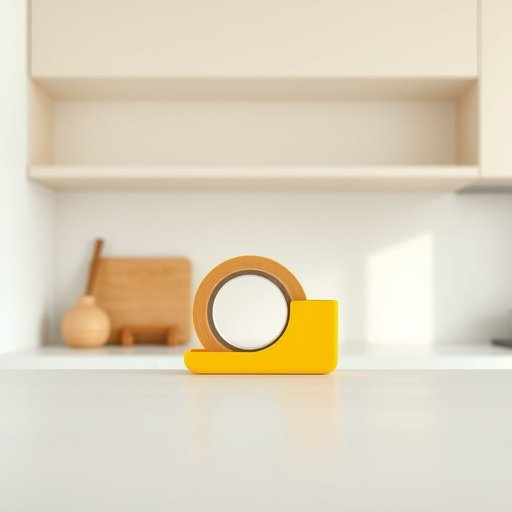

# tape

<h1 style="font-size: 2.5em; font-weight: 300; letter-spacing: 2px; margin: 0; color: #2c3e50;">
/teɪp/
</h1>

---

---

## 例句

Could you please pass me the tape that’s stuck behind the kitchen cupboard, the one with the bright yellow dispenser, because I need to seal up these parcels securely before the courier arrives this afternoon?

*Could(/kʊd/) you(/ju/) please(/pliz/) pass(/pæs/) me(/mi/) the(/ðə/) tape(/teɪp/) that’s(/that’s*/) stuck(/stək/) behind(/bɪˈhaɪnd/) the(/ðə/) kitchen(/ˈkɪʧən/) cupboard,(/ˈkəbərd,/) the(/ðə/) one(/wən/) with(/wɪθ/) the(/ðə/) bright(/braɪt/) yellow(/ˈjɛloʊ/) dispenser,(/dɪˈspɛnsər,/) because(/bɪˈkəz/) I(/aɪ/) need(/nid/) to(/tɪ/) seal(/sil/) up(/əp/) these(/ðiz/) parcels(/ˈpɑrsəlz/) securely(/sɪˈkjʊrli/) before(/ˌbiˈfɔr/) the(/ðə/) courier(/ˈkəriər/) arrives(/əraɪvz/) this(/ðɪs/) afternoon?(/ˌæftərˈnun?/)*

**翻译：** 请帮我拿一下卡在厨房橱柜后面的胶带，就是那个带有鲜黄色分配器的，因为我需要在快递员今天下午来之前，牢固地封好这些包裹。

---

## 解释

英语单词“tape”在家居生活用品的语境中作为名词，通常指具有粘性的条状物，用于粘合、固定或包裹物品，常见的有透明胶带（clear tape）、布基胶带（duct tape）或双面胶带（double-sided tape），使用场合包括包装箱子、修补物品、粘贴海报或电线整理等。学习者需注意“tape”作为可数名词时，可以用复数形式“tapes”，但在表示胶带整体材料时往往用不可数含义，例如“some tape”；常见搭配有“adhesive tape”（粘胶带）、“sticky tape”（胶带）、“packing tape”（打包胶带）等，表达时常与动词“put on”、“stick”、“remove”等搭配使用。词源上，“tape”源自中古英语，来源于古法语“tape”，进一步追溯到拉丁语“tapēnum”，意指窄织布带，最初用于束缚或装饰，后演变为现代表示各种带状材料。对此词在中文语境中的准确翻译主要为“胶带”或“胶布”，依据不同类型具体称呼如“透明胶带”、“布基胶带”，其核心含义为用来粘合的带状物，无褒贬色彩，属于中性常用词汇，且在日常家庭生活中极为常见和实用。

---

<small style="color: #999; font-size: 0.9em;">2025-07-17 06:22:40</small>

