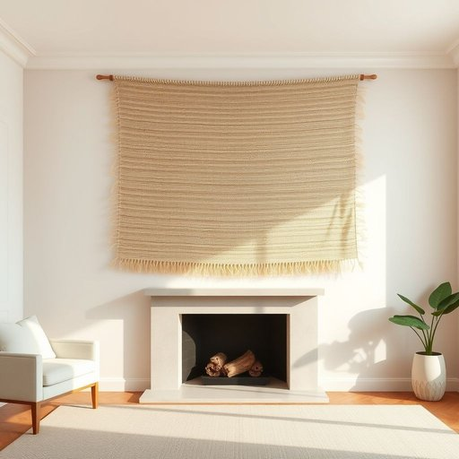

# tapestry

<h1 style="font-size: 2.5em; font-weight: 300; letter-spacing: 2px; margin: 0; color: #2c3e50;">
/ˈtæpəstri/
</h1>

---

---

## 例句

The rich, hand-woven tapestry hanging above the fireplace not only adds a splash of colour and texture to the otherwise minimalist living room but also serves as a cherished family heirloom, reminding us of the craftsmanship passed down through generations.

*The(/ðə/) rich,(/rɪʧ,/) hand-woven(/hand-woven*/) tapestry(/ˈtæpəstri/) hanging(/ˈhæŋɪŋ/) above(/əˈbəv/) the(/ðə/) fireplace(/ˈfaɪərˌpleɪs/) not(/nɑt/) only(/ˈoʊnli/) adds(/ædz/) a(/ə/) splash(/splæʃ/) of(/əv/) colour(/ˈkələr/) and(/ənd/) texture(/ˈtɛksʧər/) to(/tɪ/) the(/ðə/) otherwise(/ˈəðərˌwaɪz/) minimalist(/ˈmɪnəməlɪst/) living(/ˈlɪvɪŋ/) room(/rum/) but(/bət/) also(/ˈɔlsoʊ/) serves(/sərvz/) as(/ɛz/) a(/ə/) cherished(/ˈʧɛrɪʃt/) family(/ˈfæməli/) heirloom,(/ˈɛˌrlum,/) reminding(/riˈmaɪndɪŋ/) us(/ˈjuˈɛs/) of(/əv/) the(/ðə/) craftsmanship(/ˈkræftsmənˌʃɪp/) passed(/pæst/) down(/daʊn/) through(/θru/) generations.(/ˌʤɛnərˈeɪʃənz./)*

**翻译：** 挂在壁炉上方的精美手工编织挂毯，不仅为这间极简主义的客厅增添了一抹色彩与质感，更是一件珍贵的家族传承之物，时刻提醒着我们那代代相传的匠心技艺。

---

## 解释

英语单词“tapestry”在家居生活用品语境中作为名词，通常指一种装饰性的织锦挂毯，用以美化墙面或家具表面，常见于客厅、书房等家居空间，既具有实用的保温隔音作用，也体现主人品味和艺术审美。学习者使用该词时应注意它是可数名词，复数形式为“tapestries”，常见搭配有“hang a tapestry”（悬挂挂毯）、“a beautiful tapestry”（美丽的挂毯）、“a tapestry design”（挂毯图案）等，表达时应结合装饰和艺术两个语境以准确传达含义。该词源自中古英语“tapestrie”，继承自法语“tapisserie”，而其最终渊源可追溯至拉丁语“tapetium”，含意为铺地织物，反映出挂毯起初主要用于地毯和覆盖用途的历史背景。在中文语境中，“tapestry”一般翻译为“挂毯”或“织锦挂毯”，强调其手工织造的艺术性和装饰功能，通常无褒贬色彩，但因其历史和工艺价值，常带有浓厚的文化底蕴和艺术欣赏意义，因此理解时应注重其作为艺术装饰品在家庭环境中的独特地位。

---

<small style="color: #999; font-size: 0.9em;">2025-07-17 06:22:41</small>

