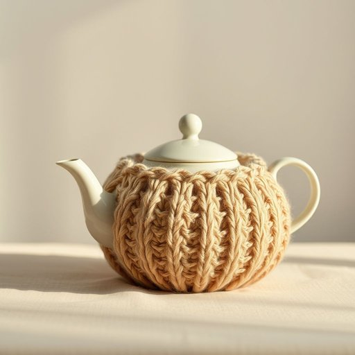

# tea-cosy

<h1 style="font-size: 2.5em; font-weight: 300; letter-spacing: 2px; margin: 0; color: #2c3e50;">
/tea-cosy*/
</h1>

---

---

## 例句

Every morning, before settling down with a good book, she carefully placed the beautifully knitted tea-cosy, which her grandmother had lovingly crafted from soft wool with intricate patterns, over the teapot to keep the brew warm, ensuring that the flavour remained rich and the tea inviting for an afternoon treat.

*Every(/ˈɛvəri/) morning,(/ˈmɔrnɪŋ,/) before(/ˌbiˈfɔr/) settling(/ˈsɛtəlɪŋ/) down(/daʊn/) with(/wɪθ/) a(/ə/) good(/gʊd/) book,(/bʊk,/) she(/ʃi/) carefully(/ˈkɛrfəli/) placed(/pleɪst/) the(/ðə/) beautifully(/ˈbjutəfli/) knitted(/ˈnɪtɪd/) tea-cosy,(/tea-cosy*,/) which(/wɪʧ/) her(/hər/) grandmother(/ˈgrændˌməðər/) had(/hæd/) lovingly(/ˈləvɪŋli/) crafted(/ˈkræftɪd/) from(/frəm/) soft(/sɔft/) wool(/wʊl/) with(/wɪθ/) intricate(/ˈɪntrəkət/) patterns,(/ˈpætərnz,/) over(/ˈoʊvər/) the(/ðə/) teapot(/ˈtiˌpɑt/) to(/tɪ/) keep(/kip/) the(/ðə/) brew(/bru/) warm,(/wɔrm,/) ensuring(/ɪnˈʃʊrɪŋ/) that(/ðət/) the(/ðə/) flavour(/flavour*/) remained(/rɪˈmeɪnd/) rich(/rɪʧ/) and(/ənd/) the(/ðə/) tea(/ti/) inviting(/ˌɪnˈvaɪtɪŋ/) for(/fər/) an(/ən/) afternoon(/ˌæftərˈnun/) treat.(/trit./)*

**翻译：** 每天清晨，在安坐阅读一本好书之前，她都会小心翼翼地将那只由祖母用柔软的羊毛精心织就、图案精美的茶壶罩套在茶壶上，以保持茶汤温热，确保茶味浓郁，茶香诱人，成为下午茶时分的一份美好享受。

---

## 解释

“tea-cosy”作为名词，指的是一种用于覆盖茶壶、保持茶水温暖的家居用品，通常由布料制成，可套在茶壶上以防止茶水快速变凉，常见于英国家庭饮茶场合，尤其是在下午茶时间或休闲聚会中使用。英语学习者在使用该词时应注意其拼写为复合词，通常用连字符连接，同时作为可数名词，前面可加冠词如“a”或“the”，搭配常见表达如“put on a tea cosy”或“a woollen tea cosy”，强调材质和用途也较普遍。此词源自19世纪英国，当时为保持茶壶中茶水温度，人们设计了专门的保温罩，cosy意为“舒适的、温暖的”，合成词“tea-cosy”即指“让茶保持温暖的罩子”。在中文语境中，tea-cosy准确翻译为“茶壶罩”或“茶壶保温罩”，强调其实用功能，属于中性词汇，无褒贬含义，也无特殊文化色彩，仅反映一种实用的生活用品。在描述茶文化或家庭用品时使用该词，能够体现对传统英式饮茶习惯的理解和尊重。

---

<small style="color: #999; font-size: 0.9em;">2025-07-17 06:22:41</small>

