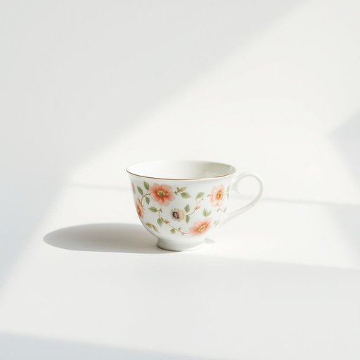

# tea-cup

<h1 style="font-size: 2.5em; font-weight: 300; letter-spacing: 2px; margin: 0; color: #2c3e50;">
/tea-cup*/
</h1>

---

---

## 例句

Could you please hand me the delicate porcelain tea-cup with the floral pattern, the one that sits on the top shelf beside the antique silver tray, so I can pour us both a proper cup of tea before we settle down to watch the afternoon news?

*Could(/kʊd/) you(/ju/) please(/pliz/) hand(/hænd/) me(/mi/) the(/ðə/) delicate(/ˈdɛləkət/) porcelain(/ˈpɔrsələn/) tea-cup(/tea-cup*/) with(/wɪθ/) the(/ðə/) floral(/ˈflɔrəl/) pattern,(/ˈpætərn,/) the(/ðə/) one(/wən/) that(/ðət/) sits(/sɪts/) on(/ɔn/) the(/ðə/) top(/tɔp/) shelf(/ʃɛlf/) beside(/ˌbiˈsaɪd/) the(/ðə/) antique(/ænˈtik/) silver(/ˈsɪlvər/) tray,(/treɪ,/) so(/soʊ/) I(/aɪ/) can(/kən/) pour(/pɔr/) us(/ˈjuˈɛs/) both(/boʊθ/) a(/ə/) proper(/ˈprɑpər/) cup(/kəp/) of(/əv/) tea(/ti/) before(/ˌbiˈfɔr/) we(/wi/) settle(/ˈsɛtəl/) down(/daʊn/) to(/tɪ/) watch(/wɔʧ/) the(/ðə/) afternoon(/ˌæftərˈnun/) news?(/nuz?/)*

**翻译：** 请把那个带有花卉图案的精致瓷茶杯递给我，就是放在顶层架子上、古董银盘旁边的那只，好让我给我们各自斟上一杯正宗的茶，然后再坐下来一起观看下午的新闻。

---

## 解释

英语单词“tea-cup”在家居生活用品场景中作为名词，指的是用来喝茶的小杯子，通常容量较小，形状多样，常配有杯碟，适用于家庭、咖啡馆或茶馆等环境。在具体使用场合上，它通常出现在谈论餐具、饮茶习惯或家居装饰时，比如“a porcelain tea-cup”（瓷制茶杯）或“a set of tea-cups”（茶杯套装）。英语学习者在使用该词时应注意其复合词结构，由“tea”和“cup”构成，复合词作为一个整体使用，且作为可数名词时需注意单复数变化，如“one tea-cup”对比“two tea-cups”；此外，搭配常见的词有“handle”（把手）、“saucer”（杯碟）、“set”（套装）和“fill”（装满），表达时常见结构有“a tea-cup of tea”（一杯茶），注意其中的“tea”既指饮品，也在复合词中限定“cup”的用途。该词起源于18世纪英国，伴随英格兰茶文化的兴盛而出现，最初指专门饮茶所用的小杯，反映出当时对茶饮礼仪的重视。中文语境中，“tea-cup”准确译为“茶杯”，指带把手、容量较小、专门用于喝茶的小杯子，区别于容量更大或形状不同的普通杯子或咖啡杯。在文化内涵上，茶杯往往与英式下午茶等礼仪密切相关，具有一定的优雅和传统气息，无褒贬意义，主要体现日常生活用具的典雅风格。

---

<small style="color: #999; font-size: 0.9em;">2025-07-17 06:22:41</small>

