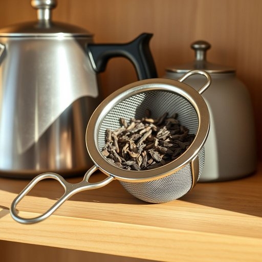

# tea-infuser

<h1 style="font-size: 2.5em; font-weight: 300; letter-spacing: 2px; margin: 0; color: #2c3e50;">
/tea-infuser*/
</h1>

---

---

## 例句

Could you please hand me the tea-infuser that’s sitting next to the kettle on the shelf, the one with the fine mesh and the sturdy handle, because I want to brew a pot of Earl Grey tea using loose leaves, which, as you know, tends to have a stronger aroma and flavour compared to the tea bags we usually use?

*Could(/kʊd/) you(/ju/) please(/pliz/) hand(/hænd/) me(/mi/) the(/ðə/) tea-infuser(/tea-infuser*/) that’s(/that’s*/) sitting(/ˈsɪtɪŋ/) next(/nɛkst/) to(/tɪ/) the(/ðə/) kettle(/ˈkɛtəl/) on(/ɔn/) the(/ðə/) shelf,(/ʃɛlf,/) the(/ðə/) one(/wən/) with(/wɪθ/) the(/ðə/) fine(/faɪn/) mesh(/mɛʃ/) and(/ənd/) the(/ðə/) sturdy(/ˈstərdi/) handle,(/ˈhændəl,/) because(/bɪˈkəz/) I(/aɪ/) want(/wɔnt/) to(/tɪ/) brew(/bru/) a(/ə/) pot(/pɑt/) of(/əv/) Earl(/ərl/) Grey(/greɪ/) tea(/ti/) using(/ˈjuzɪŋ/) loose(/lus/) leaves,(/livz,/) which,(/wɪʧ,/) as(/ɛz/) you(/ju/) know,(/noʊ,/) tends(/tɛndz/) to(/tɪ/) have(/hæv/) a(/ə/) stronger(/ˈstrɔŋgər/) aroma(/ərˈoʊmə/) and(/ənd/) flavour(/flavour*/) compared(/kəmˈpɛrd/) to(/tɪ/) the(/ðə/) tea(/ti/) bags(/bægz/) we(/wi/) usually(/ˈjuʒəwəli/) use?(/juz?/)*

**翻译：** 请把架子上水壶旁边那个细网状且手柄结实的茶叶过滤器递给我好吗？我想用散茶叶泡一壶伯爵茶，你知道的，这种茶比我们平常用的茶包香气和味道更浓郁。

---

## 解释

“tea-infuser”作为名词，指的是一种用于泡茶的小型器具，通常由金属或硅胶制成，用来盛放散装茶叶，使茶叶能够在热水中浸泡释放香味而不散落。这种器具常见于家居生活用品中，尤其是在需要自制茶饮时使用，如在厨房、茶室或办公室的休息区。使用“tea-infuser”时，英语学习者应注意它是一个复合名词，通常作为单数或复数使用，复数形式为“tea-infusers”，在句中多作可数名词出现。常见搭配包括“use a tea-infuser”（使用茶叶滤器）、“fill the tea-infuser with tea leaves”（将茶叶装入茶叶滤器）等，表达时也可通过形容词修饰，如“metal tea-infuser”或“mesh tea-infuser”来具体说明材质或类型。词源方面，“infuser”来自动词“infuse”，意为“浸泡”，加上“tea”形成复合词，直译即“茶叶浸泡器”，反映了其功能属性。在中文语境中，“tea-infuser”准确翻译为“茶叶滤器”或“茶叶渣滤器”，强调其作为过滤茶叶渣、防止茶叶散落的器具用途。该词汇无明显褒贬色彩，属于中性词，文化上体现了西方泡茶习惯中对便捷和卫生的重视，与东方传统茶具（如茶壶、茶漏）在形式和使用细节上有所区别。总体而言，理解“tea-infuser”时应结合实际泡茶场景，掌握其介词和形容词搭配，准确把握用途和结构特征，有助于在生活和语言交流中正确使用。

---

<small style="color: #999; font-size: 0.9em;">2025-07-17 06:22:41</small>

