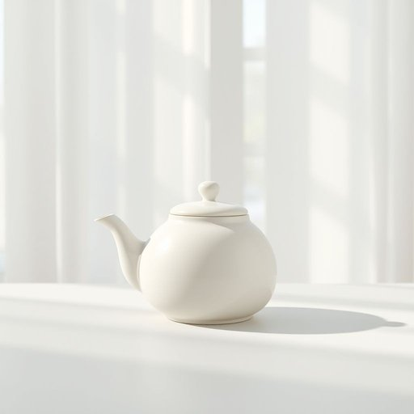

# tea-pot

<h1 style="font-size: 2.5em; font-weight: 300; letter-spacing: 2px; margin: 0; color: #2c3e50;">
/tea-pot*/
</h1>

---

---

## 例句

After carefully selecting the finest loose-leaf tea from the pantry, she filled the vintage ceramic tea-pot, which had intricate floral patterns painted by hand, with hot water and let it steep patiently on the kitchen table, where sunlight filtered through the lace curtains and cast delicate shadows.

*After(/ˈæftər/) carefully(/ˈkɛrfəli/) selecting(/səˈlɛktɪŋ/) the(/ðə/) finest(/ˈfaɪnəst/) loose-leaf(/loose-leaf*/) tea(/ti/) from(/frəm/) the(/ðə/) pantry,(/ˈpæntri,/) she(/ʃi/) filled(/fɪld/) the(/ðə/) vintage(/ˈvɪntɪʤ/) ceramic(/sərˈæmɪk/) tea-pot,(/tea-pot*,/) which(/wɪʧ/) had(/hæd/) intricate(/ˈɪntrəkət/) floral(/ˈflɔrəl/) patterns(/ˈpætərnz/) painted(/ˈpeɪnɪd/) by(/baɪ/) hand,(/hænd,/) with(/wɪθ/) hot(/hɑt/) water(/ˈwɔtər/) and(/ənd/) let(/lɛt/) it(/ɪt/) steep(/stip/) patiently(/ˈpeɪʃəntli/) on(/ɔn/) the(/ðə/) kitchen(/ˈkɪʧən/) table,(/ˈteɪbəl,/) where(/wɛr/) sunlight(/ˈsənˌlaɪt/) filtered(/ˈfɪltərd/) through(/θru/) the(/ðə/) lace(/leɪs/) curtains(/ˈkərtənz/) and(/ənd/) cast(/kæst/) delicate(/ˈdɛləkət/) shadows.(/ˈʃæˌdoʊz./)*

**翻译：** 她从储藏室中精心挑选出上等的散叶茶，倒入那只绘有精致手绘花纹的复古陶茶壶，注入热水后，将茶壶耐心地放置在厨房的桌上。透过蕾丝窗帘洒入的阳光，投下了柔和细腻的影子。

---

## 解释

英语单词“tea-pot”作为名词在家居生活用品的语境中指的是专门用来泡茶并倒茶的壶，一般由陶瓷、玻璃、不锈钢等材料制成，通常配有壶身、壶盖和壶嘴，使用场合多为家庭、茶馆或办公场所，用于盛放热茶以便饮用。英语学习者在使用“tea-pot”时需注意其为可数名词，复数形式为“tea-pots”，且在描述时常与茶叶（tea）、水（water）、热（hot）等词搭配，如“fill the tea-pot with hot water”（用热水装满茶壶），“a ceramic tea-pot”（陶瓷茶壶），同时可用于形容词性修饰，如“tea-pot handle”（茶壶把手），但需要避免将“tea-pot”误用为“teapot”一词，该合写形式更为常见且标准。此外，“tea-pot”一词的词源源自英语“tea”（茶）与“pot”（壶）两个简单单词的组合，反映了其功能和形状的直观特征，最早起源于17世纪末至18世纪初，随着茶叶从亚洲传入欧洲，茶壶作为泡茶工具开始普及。在中文语境下，“tea-pot”准确翻译为“茶壶”，该词无特殊褒贬含义或强烈文化色彩，但在英美等地，茶壶不仅是实用品，有时也具备装饰或收藏价值，体现一定的生活品味和文化传统，因此在使用时应结合具体语境理解其字面和隐含意义。

---

<small style="color: #999; font-size: 0.9em;">2025-07-17 06:22:41</small>

