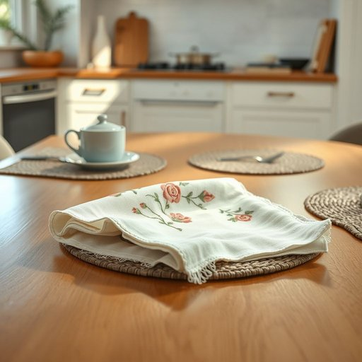

# tea-towel

<h1 style="font-size: 2.5em; font-weight: 300; letter-spacing: 2px; margin: 0; color: #2c3e50;">
/tea-towel*/
</h1>

---

---

## 例句

After drying the freshly washed dishes, she carefully folded the embroidered tea-towel, which her grandmother had hand-stitched with intricate floral patterns, and placed it neatly on the kitchen counter alongside the matching set of placemats and coasters.

*After(/ˈæftər/) drying(/draɪɪŋ/) the(/ðə/) freshly(/ˈfrɛʃli/) washed(/wɑʃt/) dishes,(/ˈdɪʃɪz,/) she(/ʃi/) carefully(/ˈkɛrfəli/) folded(/ˈfoʊldɪd/) the(/ðə/) embroidered(/ɛmˈbrɔɪdərd/) tea-towel,(/tea-towel*,/) which(/wɪʧ/) her(/hər/) grandmother(/ˈgrændˌməðər/) had(/hæd/) hand-stitched(/hand-stitched*/) with(/wɪθ/) intricate(/ˈɪntrəkət/) floral(/ˈflɔrəl/) patterns,(/ˈpætərnz,/) and(/ənd/) placed(/pleɪst/) it(/ɪt/) neatly(/ˈnitli/) on(/ɔn/) the(/ðə/) kitchen(/ˈkɪʧən/) counter(/ˈkaʊntər/) alongside(/əˈlɔŋˈsaɪd/) the(/ðə/) matching(/ˈmæʧɪŋ/) set(/sɛt/) of(/əv/) placemats(/placemats*/) and(/ənd/) coasters.(/ˈkoʊstərz./)*

**翻译：** 她在擦干刚洗好的碗碟后，细心地将那条由祖母亲手绣有精致花纹的刺绣茶巾叠好，整齐地摆放在厨房台面上，与一套配套的餐垫和杯垫并列。

---

## 解释

tea-towel作为名词在家居生活用品的语境中，指的是一种用于擦干碗碟、手或厨房台面的布制小毛巾，通常质地轻薄且吸水性良好，常见于厨房场合，特别是在洗碗后使用。英语学习者在使用tea-towel时应注意其拼写多为连字符形式，且一般作为可数名词出现，例如a tea-towel、two tea-towels。此外，常见搭配包括dry with a tea-towel（用茶巾擦干）、hang the tea-towel（挂起茶巾）等。词源上，tea-towel源自英国英语，最初是指用来擦拭泡茶过程中茶壶或茶杯的小布，19世纪逐渐演变成厨房常用擦布；这一用法反映了英国人饮茶文化对厨房用具的影响。在中文语境中，tea-towel通常译为擦碟布、厨房毛巾或茶巾，应根据具体用途灵活选择，但茶巾更偏向传统称呼，现代家居环境中多称厨房毛巾或擦碟布以突出用途。tea-towel一词本身没有褒贬色彩，但其传统英国厨房文化背景使其带有一定的地域色彩，非英国或英联邦国家的人可能鲜少使用该词，更偏好使用kitchen towel或dish towel。

---

<small style="color: #999; font-size: 0.9em;">2025-07-17 06:22:41</small>

