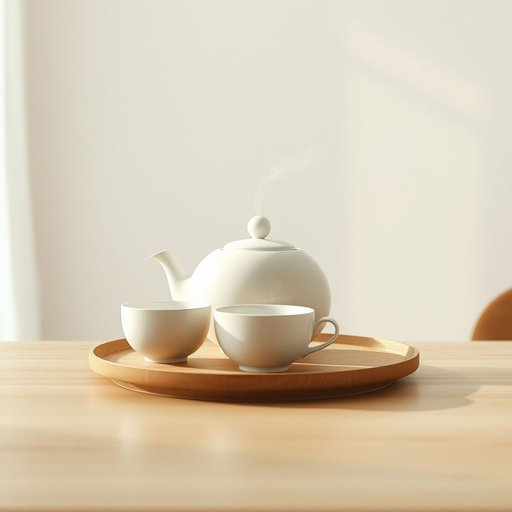

# tea

<h1 style="font-size: 2.5em; font-weight: 300; letter-spacing: 2px; margin: 0; color: #2c3e50;">
/ti/
</h1>

---

---

## 例句

After a long day spent tidying the living room and sorting through the never-ending pile of mail on the kitchen counter, I finally put the kettle on, eagerly anticipating the comforting ritual of having a strong cup of tea, which, in my opinion, is not just a beverage but an essential part of unwinding in any British household.

*After(/ˈæftər/) a(/ə/) long(/lɔŋ/) day(/deɪ/) spent(/spɛnt/) tidying(/tidying*/) the(/ðə/) living(/ˈlɪvɪŋ/) room(/rum/) and(/ənd/) sorting(/ˈsɔrtɪŋ/) through(/θru/) the(/ðə/) never-ending(/ˌnɛvərˈɛndɪŋ/) pile(/paɪl/) of(/əv/) mail(/meɪl/) on(/ɔn/) the(/ðə/) kitchen(/ˈkɪʧən/) counter,(/ˈkaʊntər,/) I(/aɪ/) finally(/ˈfaɪnəli/) put(/pʊt/) the(/ðə/) kettle(/ˈkɛtəl/) on,(/ɔn,/) eagerly(/ˈigərli/) anticipating(/ænˈtɪsəˌpeɪtɪŋ/) the(/ðə/) comforting(/ˈkəmfərtɪŋ/) ritual(/ˈrɪʧuəl/) of(/əv/) having(/ˈhævɪŋ/) a(/ə/) strong(/strɔŋ/) cup(/kəp/) of(/əv/) tea,(/ti,/) which,(/wɪʧ,/) in(/ɪn/) my(/maɪ/) opinion,(/əˈpɪnjən,/) is(/ɪz/) not(/nɑt/) just(/ʤɪst/) a(/ə/) beverage(/ˈbɛvərɪʤ/) but(/bət/) an(/ən/) essential(/ɛˈsɛnʃəl/) part(/pɑrt/) of(/əv/) unwinding(/ənˈwaɪndɪŋ/) in(/ɪn/) any(/ˈɛni/) British(/ˈbrɪtɪʃ/) household.(/ˈhaʊsˌhoʊld./)*

**翻译：** 经过一天忙碌地整理客厅和清理厨房台面上那永无止境的邮件堆后，我终于烧开了水，满怀期待地享受这一温馨的仪式——品一杯浓茶。依我看，这不仅仅是一种饮品，更是任何英国家庭放松身心不可或缺的一部分。

---

## 解释

英语单词“tea”作为名词在家居生活用品的语境中，主要指供饮用的茶叶或泡制出的茶水，常用于描述一种日常饮品，适合早餐、下午茶或晚餐时饮用，尤其在英国家庭生活中，“tea”不仅指饮料本身，也暗示一种休闲、社交的氛围。学习者使用“tea”时需注意其单数形式，通常不可数，意指茶叶或茶水，但也能复数形式teas，指不同种类的茶；常见搭配包括“一杯茶”、红茶、绿茶、茶叶、一壶茶等，此外，短语“tea time”指下午茶时间，体现文化习惯。词源上，“tea”源自中文闽南语“茶”，通过荷兰语引入英语，显示出茶叶作为中国文化的重要输出品对英语词汇的影响。在中文语境中，“tea”准确翻译为“茶”，既指茶叶本身，也指用茶叶泡制的饮品，理解时应区分作为具体物品与饮品的双重含义。文化上，英语中的“tea”偶尔带有英国传统的礼仪色彩，尤其是在社交场合中，而在某些方言或地区，“tea”亦可表示晚餐，需根据语境灵活判断，无明显褒贬，但蕴含舒适、温馨的家居生活氛围。

---

<small style="color: #999; font-size: 0.9em;">2025-07-17 06:22:41</small>

