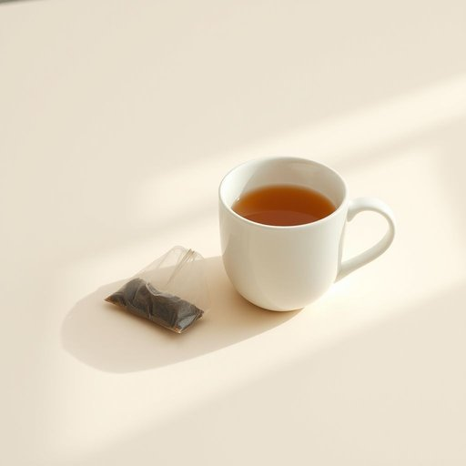

# teabag

<h1 style="font-size: 2.5em; font-weight: 300; letter-spacing: 2px; margin: 0; color: #2c3e50;">
/teabag*/
</h1>

---

---

## 例句

After realizing we’d run out of loose leaf tea, I quickly grabbed a teabag from the cupboard, which, despite being less flavorful, proved to be a convenient solution for making a hot drink while tidying up the living room and preparing for our unexpected guests.

*After(/ˈæftər/) realizing(/ˈriəˌlaɪzɪŋ/) we’d(/we’d*/) run(/rən/) out(/aʊt/) of(/əv/) loose(/lus/) leaf(/lif/) tea,(/ti,/) I(/aɪ/) quickly(/kˈwɪkli/) grabbed(/græbd/) a(/ə/) teabag(/teabag*/) from(/frəm/) the(/ðə/) cupboard,(/ˈkəbərd,/) which,(/wɪʧ,/) despite(/dɪˈspaɪt/) being(/biɪŋ/) less(/lɛs/) flavorful,(/ˈfleɪvərfəl,/) proved(/pruvd/) to(/tɪ/) be(/bi/) a(/ə/) convenient(/kənˈvinjənt/) solution(/səˈluʃən/) for(/fər/) making(/ˈmeɪkɪŋ/) a(/ə/) hot(/hɑt/) drink(/drɪŋk/) while(/waɪl/) tidying(/tidying*/) up(/əp/) the(/ðə/) living(/ˈlɪvɪŋ/) room(/rum/) and(/ənd/) preparing(/pərˈpɛrɪŋ/) for(/fər/) our(/ɑr/) unexpected(/ˌənɪkˈspɛktɪd/) guests.(/gɛsts./)*

**翻译：** 意识到散装茶叶用完后，我迅速从橱柜里拿出一包茶包，虽然口感略逊一筹，但在整理客厅和准备迎接意外来访的客人时，仍然是一个方便的热饮选择。

---

## 解释

单词“teabag”作为名词在家居生活用品场景中主要指的是用来泡茶的小袋茶包，通常是由透气的纸或布制成，内部装有茶叶。具体使用场合多见于泡茶时，例如在厨房或餐桌上，人们会说“一包茶包用来泡茶”，强调其方便快捷的冲泡方式。英语学习者在使用“teabag”时需注意它是可数名词，单数形式是“teabag”，复数形式是“teabags”，常见搭配有“用茶包泡的一杯茶”“散茶与茶包”。此外，“teabag”一词起源于20世纪初，当时为了方便冲泡和携带，茶叶被装入小袋，类似于小布袋，因而得名。中文中“teabag”准确翻译为“茶包”，“茶袋”亦可，但“茶包”更普遍且规范。在使用时应避免将其与俚语“teabagging”混淆，后者具有粗俗的性暗示，属于非正式甚至冒犯性的用法，因此在正式语境和学习中应以“茶包”之义使用，保持语义的纯洁和礼貌。总体而言，“teabag”在家居生活用品语境中是一个中性、日常生活中常用的名词，用以指代方便泡制的茶叶小袋，具有明确且无褒贬色彩的含义。

---

<small style="color: #999; font-size: 0.9em;">2025-07-17 06:22:41</small>

