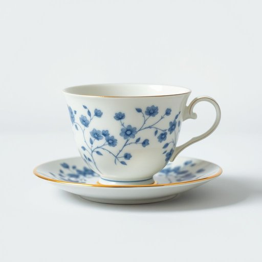

# teacup

<h1 style="font-size: 2.5em; font-weight: 300; letter-spacing: 2px; margin: 0; color: #2c3e50;">
/ˈtiˌkəp/
</h1>

---

---

## 例句

Could you please pass me the delicate porcelain teacup, the one with the intricate blue floral pattern that Grandma brought back from Cornwall, because I want to serve the Earl Grey tea just the way she used to, with a splash of milk and no sugar?

*Could(/kʊd/) you(/ju/) please(/pliz/) pass(/pæs/) me(/mi/) the(/ðə/) delicate(/ˈdɛləkət/) porcelain(/ˈpɔrsələn/) teacup,(/ˈtiˌkəp,/) the(/ðə/) one(/wən/) with(/wɪθ/) the(/ðə/) intricate(/ˈɪntrəkət/) blue(/blu/) floral(/ˈflɔrəl/) pattern(/ˈpætərn/) that(/ðət/) Grandma(/ˈgrændmɑ/) brought(/brɔt/) back(/bæk/) from(/frəm/) Cornwall,(/ˈkɔrnwɔl,/) because(/bɪˈkəz/) I(/aɪ/) want(/wɔnt/) to(/tɪ/) serve(/sərv/) the(/ðə/) Earl(/ərl/) Grey(/greɪ/) tea(/ti/) just(/ʤɪst/) the(/ðə/) way(/weɪ/) she(/ʃi/) used(/juzd/) to,(/tɪ,/) with(/wɪθ/) a(/ə/) splash(/splæʃ/) of(/əv/) milk(/mɪlk/) and(/ənd/) no(/noʊ/) sugar?(/ˈʃʊgər?/)*

**翻译：** 您能把那只精致的瓷茶杯递给我吗？就是那只带有奶奶从康沃尔带回来的复杂蓝色花卉图案的杯子，因为我想像她以前那样泡伯爵茶，加一点牛奶，不加糖。

---

## 解释

英语单词“teacup”作为名词，指的是一种专门用来盛茶的小型杯子，通常配有杯柄，材质多为瓷器或陶瓷，广泛应用于家庭和社交场合中饮茶时使用。具体使用场合多见于家居生活，如早餐、下午茶、宴会等，需要优雅品茶的环境，同时也常用于描述传统英式茶具。英语学习者在使用“teacup”时应注意它是可数名词，常见搭配有“一teacup of tea”（一杯茶）、“teacup set”（茶杯套装）等，且在复数形式时需加-s变为“teacups”。此外，常见的表达技巧包括与“saucer”（茶托）连用，如“teacup and saucer”，体现完整的茶具组合。词源方面，“teacup”由“tea”（茶）和“cup”（杯子）组合而成，其中“tea”一词源于汉语闽南语“te”通过荷兰语传入英语，体现了文化交流的历史背景。中文语境中，“teacup”一般准确翻译为“茶杯”，指的是专门用于饮茶的小杯子，区别于其他类型的杯子如“咖啡杯”或“水杯”。需要注意的是，虽然“teacup”本身无特别褒贬含义，但在文化层面，茶杯及其相关茶具承载着一定的礼仪和审美价值，尤其是在体现传统英式或中式茶文化时，象征着优雅和仪式感。

---

<small style="color: #999; font-size: 0.9em;">2025-07-17 06:22:41</small>

