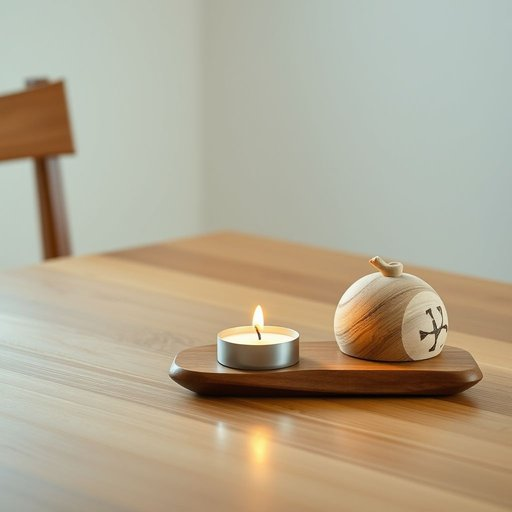

# tealight

<h1 style="font-size: 2.5em; font-weight: 300; letter-spacing: 2px; margin: 0; color: #2c3e50;">
/tealight*/
</h1>

---

---

## 例句

Could you please place a tealight in the decorative holder on the dining table, which not only adds a warm ambiance during our dinner but also complements the rustic charm of the wooden centerpiece we bought last summer?

*Could(/kʊd/) you(/ju/) please(/pliz/) place(/pleɪs/) a(/ə/) tealight(/tealight*/) in(/ɪn/) the(/ðə/) decorative(/ˈdɛkrətɪv/) holder(/ˈhoʊldər/) on(/ɔn/) the(/ðə/) dining(/ˈdaɪnɪŋ/) table,(/ˈteɪbəl,/) which(/wɪʧ/) not(/nɑt/) only(/ˈoʊnli/) adds(/ædz/) a(/ə/) warm(/wɔrm/) ambiance(/ˈæmbiəns/) during(/ˈdʊrɪŋ/) our(/ɑr/) dinner(/ˈdɪnər/) but(/bət/) also(/ˈɔlsoʊ/) complements(/ˈkɑmpləmənts/) the(/ðə/) rustic(/ˈrəstɪk/) charm(/ʧɑrm/) of(/əv/) the(/ðə/) wooden(/ˈwʊdən/) centerpiece(/ˈsɛntərˌpis/) we(/wi/) bought(/bɔt/) last(/læst/) summer?(/ˈsəmər?/)*

**翻译：** 请您在餐桌上的装饰烛台中放一只茶蜡灯，不仅能为我们的晚餐增添温馨的氛围，还能衬托出我们去年夏天购买的木质中心摆件的质朴韵味。

---

## 解释

“tealight”作为名词，指的是一种小型的圆柱形蜡烛，通常装在金属或塑料杯中，广泛用于家居生活中，特别是在营造氛围、装饰或作为香薰灯光源时。具体使用场合包括放置在茶蜡烛台、香薰炉、餐桌装饰或浴室等环境中，通过其柔和的光线增加温馨感或放松心情。英语学习者在使用“tealight”时需要注意它是可数名词，常以复数形式出现，如“two tealights”，且搭配常见表达包括“light a tealight”，“tealight holder”（茶蜡烛托盘）等；此外，区别于“candle”这一泛称，“tealight”强调的是小巧且容器封装的特定类型蜡烛。词源上，“tealight”一词由“tea”（茶）和“light”（灯光、蜡烛光）组合而成，源于茶时间使用的小蜡烛，最初用于加热茶壶或提供微光，逐渐扩展为通用的小蜡烛名称。中文语境中，“tealight”准确翻译为“茶蜡烛”或“茶灯”，通常理解为小型圆形蜡烛，强调其便携、短时燃烧及装在杯中的特征。此词本身无褒贬含义，属于中性词汇，文化内涵主要体现为营造舒适、休闲氛围时的家庭用品。

---

<small style="color: #999; font-size: 0.9em;">2025-07-17 06:22:41</small>

