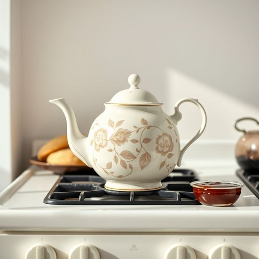

# teapot

<h1 style="font-size: 2.5em; font-weight: 300; letter-spacing: 2px; margin: 0; color: #2c3e50;">
/ˈtiˌpɑt/
</h1>

---

---

## 例句

After carefully dusting off the antique teapot, which had been passed down through generations and featured intricate floral patterns, she placed it on the stove, eager to brew a proper English breakfast tea that would perfectly complement the scones and preserves laid out on the table.

*After(/ˈæftər/) carefully(/ˈkɛrfəli/) dusting(/ˈdəstɪŋ/) off(/ɔf/) the(/ðə/) antique(/ænˈtik/) teapot,(/ˈtiˌpɑt,/) which(/wɪʧ/) had(/hæd/) been(/bɪn/) passed(/pæst/) down(/daʊn/) through(/θru/) generations(/ˌʤɛnərˈeɪʃənz/) and(/ənd/) featured(/ˈfiʧərd/) intricate(/ˈɪntrəkət/) floral(/ˈflɔrəl/) patterns,(/ˈpætərnz,/) she(/ʃi/) placed(/pleɪst/) it(/ɪt/) on(/ɔn/) the(/ðə/) stove,(/stoʊv,/) eager(/ˈigər/) to(/tɪ/) brew(/bru/) a(/ə/) proper(/ˈprɑpər/) English(/ˈɪŋlɪʃ/) breakfast(/ˈbrɛkfəst/) tea(/ti/) that(/ðət/) would(/wʊd/) perfectly(/ˈpərfəktli/) complement(/ˈkɑmpləmənt/) the(/ðə/) scones(/skoʊnz/) and(/ənd/) preserves(/prɪˈzərvz/) laid(/leɪd/) out(/aʊt/) on(/ɔn/) the(/ðə/) table.(/ˈteɪbəl./)*

**翻译：** 在仔细拂去这把祖传古董茶壶上的尘埃后，她将茶壶放在炉灶上，茶壶上雕刻着精美的花卉图案。她迫不及待地想泡一壶正宗的英式早餐茶，以完美搭配摆放在桌上的司康饼和果酱。

---

## 解释

英语单词“teapot”作为名词，在家居生活用品的语境中指的是用来泡茶和倒茶的壶，通常具有壶嘴、壶盖和把手，常用材料包括陶瓷、玻璃或金属。具体使用场合多见于家庭、茶馆或餐厅，通常用于沏茶或招待客人时，语境上多关联喝茶或茶具相关的话题。英语学习者使用“teapot”时需注意其作为可数名词，单数形式为“teapot”，复数形式为“teapots”；常见搭配有“一壶茶”、“把茶壶注满”、“从茶壶倒茶”等，表达时常强调泡茶的动作和器具本身，语法上无特别复杂用法，主要注意不可与“kettle”水壶混淆，因为kettle是用来烧水的壶，与teapot功能不同。词源上，“teapot”由“tea”茶与“pot”壶合成，最早出现在17世纪末18世纪初，源自茶文化在英国的普及，当时茶叶和相关器具逐渐成为重要的生活用品，“teapot”一词即指专门用于泡茶的壶。中文语境中，“teapot”最准确的翻译是“茶壶”，这个词既符合器物本身的功能特点，也无明显褒贬或复杂文化内涵，仅指实物，理解时应避免将其与“水壶”或“咖啡壶”等混淆。在文化层面，西方尤其英国的茶文化中，teapot象征着待客之道和日常生活的温馨，因此在英美文学和日常用语中，teapot有时也象征着家庭、舒适和社交场合的温暖氛围，但这些更多属于文化色彩而非词义本身。

---

<small style="color: #999; font-size: 0.9em;">2025-07-17 06:22:41</small>

