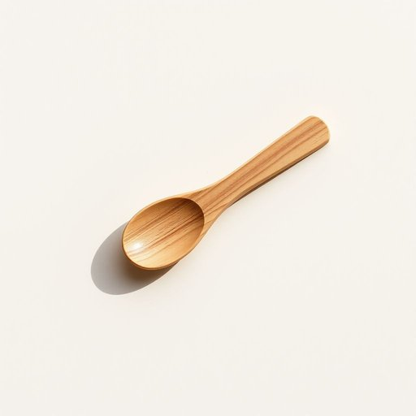

# teaspoon

<h1 style="font-size: 2.5em; font-weight: 300; letter-spacing: 2px; margin: 0; color: #2c3e50;">
/ˈtiˌspun/
</h1>

---

---

## 例句

When you’re baking the cake later, make sure to add exactly one teaspoon of vanilla extract, which, despite its small quantity, significantly enhances the overall flavour and aroma of the dessert.

*When(/wɪn/) you’re(/you’re*/) baking(/ˈbeɪkɪŋ/) the(/ðə/) cake(/keɪk/) later,(/ˈleɪtər,/) make(/meɪk/) sure(/ʃʊr/) to(/tɪ/) add(/æd/) exactly(/ɪgˈzæktli/) one(/wən/) teaspoon(/ˈtiˌspun/) of(/əv/) vanilla(/vəˈnɪlə/) extract,(/ˈɛkˌstrækt,/) which,(/wɪʧ,/) despite(/dɪˈspaɪt/) its(/ɪts/) small(/smɔl/) quantity,(/kˈwɑntəti,/) significantly(/sɪgˈnɪfɪkəntli/) enhances(/ɛnˈhænsɪz/) the(/ðə/) overall(/ˈoʊvərˌɔl/) flavour(/flavour*/) and(/ənd/) aroma(/ərˈoʊmə/) of(/əv/) the(/ðə/) dessert.(/dɪˈzərt./)*

**翻译：** 待会儿烘焙蛋糕时，一定要准确加入一茶匙香草精，虽量小，却能显著提升甜点的整体风味与香气。

---

## 解释

英语单词“teaspoon”作为名词，主要指家庭厨房中常用的小型调味工具，即“小茶匙”，其容量约为5毫升，常用于测量烹饪中香料、调味料或液体的用量。例如在食谱中常见表达“一茶匙盐”，这种量词用法在烹饪和饮食场景尤为普遍。在语法上，teaspoon作为可数名词，可以单复数形式出现，如one teaspoon, two teaspoons，使用时需注意与量词连用且通常与介词of搭配表达具体物质，如a teaspoon of sugar，此外它也可指实际的小勺本身，而非容量单位。词源上，“teaspoon”源自tea（茶）和spoon（勺子）的合成，最初指为喝茶配套的小勺，后来因其容量标准化而成为烹饪中常用的计量单位，这反映了英国家庭生活中喝茶文化对器具命名的影响。在中文语境中，“teaspoon”准确翻译为“茶匙”或“茶勺”，既指小茶匙这一具体餐具，也指以茶匙为单位的容量，理解时需结合语境区分实物和容量，两者均为烹饪常用词汇，无褒贬色彩，属中性词汇，是日常家居生活中常见且实用的词。

---

<small style="color: #999; font-size: 0.9em;">2025-07-17 06:22:41</small>

