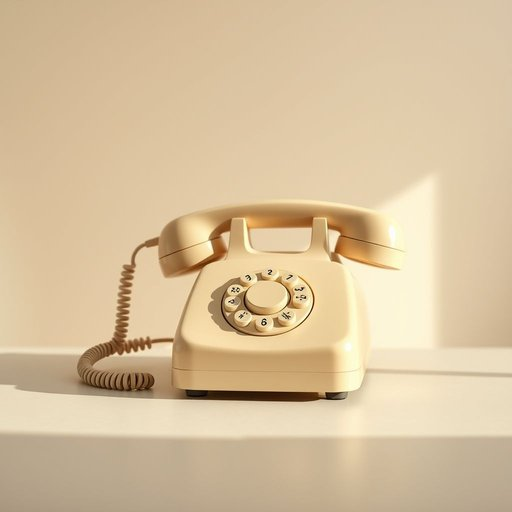

# telephone

<h1 style="font-size: 2.5em; font-weight: 300; letter-spacing: 2px; margin: 0; color: #2c3e50;">
/ˈtɛləˌfoʊn/
</h1>

---

---

## 例句

Could you please answer the telephone if it rings while I'm in the kitchen preparing dinner, and make sure to take a message in case it's the plumber calling to reschedule the appointment for repairing the leaking tap?

*Could(/kʊd/) you(/ju/) please(/pliz/) answer(/ˈænsər/) the(/ðə/) telephone(/ˈtɛləˌfoʊn/) if(/ɪf/) it(/ɪt/) rings(/rɪŋz/) while(/waɪl/) I'm(/əm/) in(/ɪn/) the(/ðə/) kitchen(/ˈkɪʧən/) preparing(/pərˈpɛrɪŋ/) dinner,(/ˈdɪnər,/) and(/ənd/) make(/meɪk/) sure(/ʃʊr/) to(/tɪ/) take(/teɪk/) a(/ə/) message(/ˈmɛsɪʤ/) in(/ɪn/) case(/keɪs/) it's(/ɪts/) the(/ðə/) plumber(/ˈpləmər/) calling(/ˈkɔlɪŋ/) to(/tɪ/) reschedule(/riˈskɛʤul/) the(/ðə/) appointment(/əˈpɔɪntmənt/) for(/fər/) repairing(/rɪˈpɛrɪŋ/) the(/ðə/) leaking(/ˈlikɪŋ/) tap?(/tæp?/)*

**翻译：** 如果电话响了，麻烦你帮我接一下，因为我正在厨房准备晚餐；如果是水管工打来要重新安排修理漏水水龙头的时间，请务必帮我记下留言。

---

## 解释

英语单词telephone作为名词，在家居生活用品语境中通常指的是固定电话机，即家中或办公室用于语音通话的设备，使用场合多为家庭、办公室等需要远距离语音交流的环境。英语学习者在使用telephone时需注意其可数性，即可以用复数形式telephones，且常见搭配包括make a telephone call（打电话）、answer the telephone（接电话）、telephone number（电话号码）等，此外，telephone既可用作名词，也可用作动词，表示拨打电话，在名词用法中不可直接用作动作。词源上，telephone源自希腊语tele-（远距的）与phone（声音、发声）组合，最早由法国发明家亚历山大·贝尔于19世纪末引入，用以描述通过电信号传输声音的装置。中文语境中，telephone通常准确翻译为电话，但具体指家用的固定电话机，区别于现代手机（mobile phone），电话一词在日常交流中较为正式和中性，通常无褒贬含义，文化上象征着通信和联系的重要工具，随着手机的普及，传统telephone逐渐较少使用，但在家居环境中仍常见，表达时需根据具体情境区分电话机和电话服务。

---

<small style="color: #999; font-size: 0.9em;">2025-07-17 06:22:41</small>

