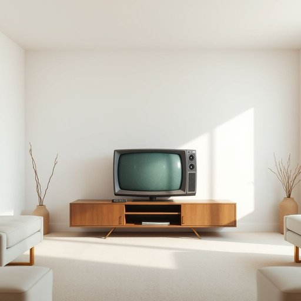

# television

<h1 style="font-size: 2.5em; font-weight: 300; letter-spacing: 2px; margin: 0; color: #2c3e50;">
/ˈtɛləˌvɪʒən/
</h1>

---

---

## 例句

Although the television in the living room isn’t the latest model, with its slightly scratched screen and somewhat outdated remote control, it still provides a perfect background for our family gatherings, where we often settle down after dinner to watch the news, enjoy a film, or simply catch up on our favourite series together.

*Although(/ˌɔlˈðoʊ/) the(/ðə/) television(/ˈtɛləˌvɪʒən/) in(/ɪn/) the(/ðə/) living(/ˈlɪvɪŋ/) room(/rum/) isn’t(/isn’t*/) the(/ðə/) latest(/ˈleɪtəst/) model,(/ˈmɑdəl,/) with(/wɪθ/) its(/ɪts/) slightly(/sˈlaɪtli/) scratched(/skræʧt/) screen(/skrin/) and(/ənd/) somewhat(/ˈsəmˈwət/) outdated(/ˈaʊtˌdeɪtɪd/) remote(/rɪˈmoʊt/) control,(/kənˈtroʊl,/) it(/ɪt/) still(/stɪl/) provides(/prəˈvaɪdz/) a(/ə/) perfect(/ˈpərˌfɪkt/) background(/ˈbækˌgraʊnd/) for(/fər/) our(/ɑr/) family(/ˈfæməli/) gatherings,(/ˈgæðərɪŋz,/) where(/wɛr/) we(/wi/) often(/ˈɔfən/) settle(/ˈsɛtəl/) down(/daʊn/) after(/ˈæftər/) dinner(/ˈdɪnər/) to(/tɪ/) watch(/wɔʧ/) the(/ðə/) news,(/nuz,/) enjoy(/ˌɛnˈʤɔɪ/) a(/ə/) film,(/fɪlm,/) or(/ər/) simply(/ˈsɪmpli/) catch(/kæʧ/) up(/əp/) on(/ɔn/) our(/ɑr/) favourite(/ˈfeɪvərɪt/) series(/ˈsɪriz/) together.(/təˈgɛðər./)*

**翻译：** 虽然客厅里的电视不是最新款，屏幕上有些划痕，遥控器也显得有些过时，但它依然是我们家庭聚会的完美背景。晚饭后，我们常常围坐在一起，看新闻、欣赏电影，或是一起追我们喜爱的剧集。

---

## 解释

英语单词television作为名词在家居生活用品的语境中主要指家庭中用来接收和播放视频及音频内容的电子设备即电视机或简称电视具体使用场合通常涉及日常生活中观看节目新闻电影或娱乐内容的场景如turn on the television打开电视或watch television in the living room在客厅看电视英语学习者使用该词时需注意其不可数用法虽然口语中常用复数形式televisions指不同的电视机但多数情况下television本身指的是视频播放这一整体设备或媒介此外常见搭配包括television set电视机television program电视节目和television channel电视频道表达时注意区分设备和内容词源方面television由希腊词根tele意为远距离和拉丁语vision意为视觉看组成始于20世纪初反映了其作为远距离传输图像的技术特点中文中television一般译为电视或电视机准确传达了其作为家用电子视听设备的功能且无特殊褒贬色彩但在文化上电视常被视为家庭娱乐和信息传播的主要媒介体现现代生活的休闲与资讯需求

---

<small style="color: #999; font-size: 0.9em;">2025-07-17 06:22:41</small>

